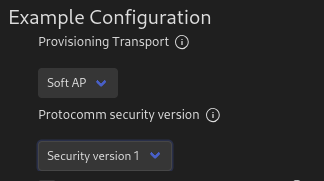
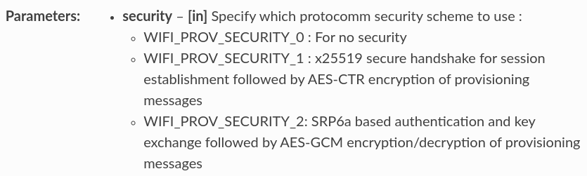
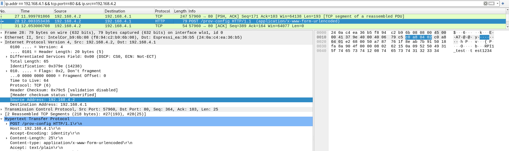

# Comprobaciones de seguridad mediante Wireshark

Para llevar a cabo las comprobaciones de seguridad a la hora de realizar el provisionamiento se utilizarán:
 - El ejemplo **provisioning/wifi-prov-mgr** en el SoC utilizado.
 - La herramienta **esp_prov.py** proporcionada por **Espressif** y que se encuentra en el directorio **esp-idf/tools/esp_prov**.
 - La herramienta de análisis de paquetes **Wireshark** para analizar las credenciales enviadas en el provisionamiento.

A continuación realizaremos dos ejecuciones de nuestra herramienta de provisionamiento, una utilizando un cifrado sobre las claves proporcionadas y otra sin implementar ninguna medida de seguridad.

## Envío de credenciales sin seguridad

Para llevar a cabo el provisionamiento primero necesitaremos ejecutar el programa de ejemplo **wifi-prov-mgr** en nuestro SoC, para lo cual deberemos configurar su uso para que utilice el modo de provisionamiento mediante AP y la versión de seguridad sin cifrado. En la siguiente imagen podemos ver la configuración dle SoC utilizada.



Para poder llevar a cabo el provisionamiento sin el uso de cifrado de seguridad deberemos especificar esto utilizando para ello la variable de configuración **WIFI_PROV_SECIRITY_0**. Las diferentes variables y la seguridad aportada por cada una puede ser vista en la siguiente imagen (Más información [Aquí](https://docs.espressif.com/projects/esp-idf/en/latest/esp32/api-reference/provisioning/wifi_provisioning.html)).




Sin embargo, esto trae consigo el problema de que el programa de ejemplo utilizado **wifi-prov-mgr** únicamente puede ser configurado para utilizar las variables **WIFI_PROV_SECIRITY_1** o **WIFI_PROV_SECIRITY_2**. Debido a esto se tiene que realizar una pequeña modificación que nos permita utilizar la variable deseada, introduciendo la siguiente definición en el caso de que el seleccionemos el modo de seguridad 1 (sin seguridad) dentro del menú de configuración:

```C
#ifdef CONFIG_EXAMPLE_PROV_SECURITY_VERSION_1
        /* What is the security level that we want (0, 1, 2):
         *      - WIFI_PROV_SECURITY_0 is simply plain text communication.
         *      - WIFI_PROV_SECURITY_1 is secure communication which consists of secure handshake
         *          using X25519 key exchange and proof of possession (pop) and AES-CTR
         *          for encryption/decryption of messages.
         *      - WIFI_PROV_SECURITY_2 SRP6a based authentication and key exchange
         *        + AES-GCM encryption/decryption of messages
         */
        wifi_prov_security_t security = WIFI_PROV_SECURITY_0;

        /* Do we want a proof-of-possession (ignored if Security 0 is selected):
         *      - this should be a string with length > 0
         *      - NULL if not used
         */
        const char *pop = "abcd1234";

        /* This is the structure for passing security parameters
         * for the protocomm security 1.
         */
        wifi_prov_security1_params_t *sec_params = pop;

        const char *username  = NULL;
```

Una vez realizados los cambios indicados, necesitaremos conectarnos con nuestro equipo a la red red WIFI generada por nuestro SoC y ejecutar la herramienta **esp_prov.py** indicando cuatro parámetros de configuración:
 - El uso de modo AP como medio de provisionamiento.
 - La IP y el puerto del sistema al cual vamos a realizar el provisionamiento.
 - El SSID de la red a al cual se deberá conectar el equipo provisionado.
 - La contraseña de la red a al cual se deberá conectar el equipo provisionado.

 En los siguientes cuadros podemos ver la orden utilizada junto a la especificación de los parámetros indicados anteriormente, además de la respuesta obtenida del la herramienta de provisionamiento. respectivamente:

```BASH
python esp_prov.py --transport softap --service_name "192.168.4.1:80" --sec_ver 0 --ssid RPI1_test --passphrase test1234
```

```BASH
++++ Connecting to 192.168.4.1:80++++
Proof of Possession required: 

==== Starting Session ====
==== Session Established ====

==== Sending Wi-Fi Credentials to Target ====
==== Wi-Fi Credentials sent successfully ====

==== Applying Wi-Fi Config to Target ====
==== Apply config sent successfully ====

==== Wi-Fi connection state  ====
==== WiFi state: Connected ====
==== Provisioning was successful ====
```

Este proceso de provisionamiento debe ser capturado mediante la herramienta **Wireshark**, con la cual podremos visualizar el contenido de la tramas de provisionamiento enviadas por la herramienta hacia nuestro SoC. Para poder ver filtrar correctamente las tramas enviadas necesitaremos especificar:
 - La dirección IP del SoC al cual estamos realizando el provisionamiento.
 - El puerto utilizado durante el proceso.
 - La dirección IP de nuestro equipo como fuente.

En la siguiente imagen podemos ver, no solo los filtros empleados, sino también como se están enviando las credenciales utilizadas en texto plano, lo cual supone una importante brecha de seguridad para la red WIFI a la cual se va a realizar la conexión del del sistema provisionado.



## Envío de credenciales con seguridad


CON CIFRADO

```BASH
 python esp_prov.py --transport softap --service_name "192.168.4.1:80" --sec_ver 1 --ssid RPI1_test --passphrase test1234
++++ Connecting to 192.168.4.1:80++++
Proof of Possession required: 

==== Starting Session ====
==== Session Established ====

==== Sending Wi-Fi Credentials to Target ====
==== Wi-Fi Credentials sent successfully ====

==== Applying Wi-Fi Config to Target ====
==== Apply config sent successfully ====

==== Wi-Fi connection state  ====
==== WiFi state: Connected ====
==== Provisioning was successful ====
```


