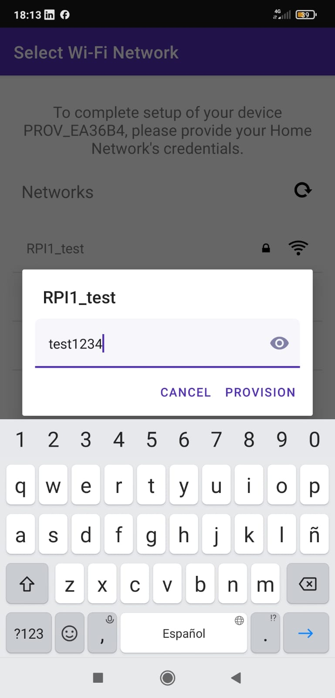
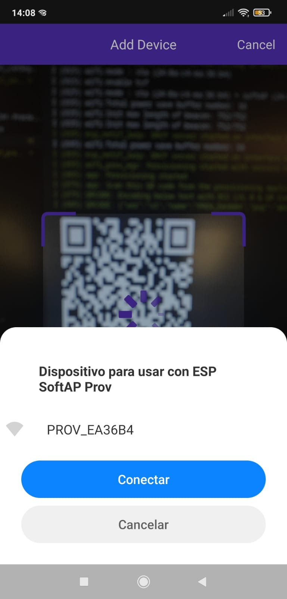

<style>
  .columnImages {
    float: left;
    padding: 5px;
    height:100%
  }

  .row::after {
    content: "";
    clear: both;
    display: table;
    width: 100%;
    height: 30%
  }
</style>


# Provisionamiento de credenciales WIFI

En este apartado llevaremos a cabo el aprovisionamiento de nuestra placa STM32 mediante el uso de diferentes aplicaciones móviles. Para poder llevar a cabo la realización del aprovisionamiento, vamos a ejecutar en nuestro SoC el ejemplo **examples/provisioning/wifi-prov-mgr**, el cuál será el encargado de gestionar la recepción de las credenciales desde nuestra aplicación móvil.

>Tarea
>
>Utilizando las aplicaciones correspondientes a tu dispositivo móvil, tanto para el uso de BLE como de SoftAP, provisiona tu ESP32 utilizando las credenciales que correspondan a tu red WiFi. Recuerda, antes de cada repetición del experimento, utilizar la orden idf.py erase_flash para eliminar información de provisionamiento de sesiones anteriores. Comprueba el funcionamiento de los distintos niveles de seguridad.
>
>Añade a tu informe las capturas de pantalla correspondientes a la salida del ESP32 que evidencien que el proceso de provisionamiento se ha realizado correctamente.

## Provisionamiento mediante BLE con seguridad

Para realizar el provisionamiento mediante BLE, tanto con seguridad como sin ella, utilizaremos la siguiente aplicación móvil:


Antes de poner a correr cualquiera de los dos extremos (el SoC utilizado por un lado y nuestro dispositivo móvil por el otro), necesitaremos configurar adecuadamente tanto la aplicación de nuestro dispositivo móvil como el ejemplo que se ejecutará en nuestra placa STM32. En las siguientes imágenes se puede observar tanto la configuración especificada en el ejemplo **wifi-prov-mgr** ejecutado en el SoC mediante el menú de configuración (izquierda), como la establecida en la aplicación móvil utilizada para llevar a cabo el provisionamiento mediante BLE (derecha).

<div class="row">
  <div class="columnImages" style="widh:50%; margin-left:10%">
    
  </div>

  <div class="columnImages" style="width:19%; float: right; margin-right:10%">
    
  </div>
</div>

Conforme podemos ver en la configuración de ambos equipo, debemos tener en cuenta:
 - El tipo de provisionamiento soportado en ambos dispositivos es BLE.
 - El nivel de seguridad establecido es nivel 2, es decir, se llevará a cabo un cifrado entre ambos extremos.
 - El número máximo de reintentos efectuados antes del provisionamiento serán 5.

Una vez llevada a cabo la configuración previa, realizaremos una limpieza de la posible información de provisionamiento establecida anteriormente en nuestro SoC mediante la herramienta **idf.py erase_flash** (acción que deberemos repetir cada vez que se realiza un nuevo provisionamiento) y ejecutaremos el programa de ejemplo **wifi-prov-mgr**. En los siguientes cuadros podemos ver las salidas obtenidas en cada uno de los pasos indicados, respectivamente.

```BASH
debian12:~$ idf.py erase_flash
Warning: Command "erase_flash" is deprecated since v4.4 and will be removed in next major release. Have you wanted to run "erase-flash" instead?
Executing action: erase_flash
CMakeLists.txt not found in project directory /home/mario
```

```BASH
I (910) BTDM_INIT: BT controller compile version [f6018c5]
I (920) BTDM_INIT: Bluetooth MAC: 24:0a:c4:ea:36:b6
I (1160) protocomm_nimble: BLE Host Task Started
I (1170) wifi_prov_mgr: Provisioning started with service name : PROV_EA36B4 
I (1170) app: Provisioning started
I (1170) app: Scan this QR code from the provisioning application for Provisioning.
I (1180) QRCODE: Encoding below text with ECC LVL 0 & QR Code Version 10
I (1180) QRCODE: {"ver":"v1","name":"PROV_EA36B4","username":"wifiprov","pop":"abcd1234","transport":"ble"}
I (1200) NimBLE: GAP procedure initiated: advertise; 
I (1200) NimBLE: disc_mode=2
I (1200) NimBLE:  adv_channel_map=0 own_addr_type=0 adv_filter_policy=0 adv_itvl_min=256 adv_itvl_max=256
I (1210) NimBLE: 

                                          
  █▀▀▀▀▀█ ▄▀ ▄█▀██▄  ▀▀ ▄█ ▀███ █▀▀▀▀▀█   
  █ ███ █ ▀███▀ ▄█▀▀ █▄ ███  █▀ █ ███ █   
  █ ▀▀▀ █ █▄ ▄ █▀█▀ ▄▄▀▀▄▀▄▀██  █ ▀▀▀ █   
  ▀▀▀▀▀▀▀ █▄▀ █ █ █▄▀ ▀▄▀▄▀ ▀▄▀ ▀▀▀▀▀▀▀   
  █▀ █▄ ▀▀ ▄█▄ █  ▀▄▀ ▀█▄ ███   ██▀▄▀█▄   
  ▄█▀▄▄█▀ ▀ ▀  ▄█  ▀▀█▀█▀▄██    ▄█▄▄▀ █   
  █▀▄▀▄▀▀█▄▄▄▄██▄▀▄▀▀▄███ █▀▄▄▀▄█  █  █   
  █▀▄▄ ▄▀▄▀ ▄ █▄█ ▀█  ▀█▀█ █▄ ███▀ ▄  ▀   
   ▀▀▀▄▀▀██ ▄▀ ▀█  ▀▀▀▀▀ ██▄▄ ▀█▀▀▄▄▀▀█   
  ██▀▄▄▀▀▀ ▀▀▄ █ ▄▀█▀▄▀▄▄ ▄ ▄ ▄▄▀██ ▄██   
   ▄▀▄▄▀▀▄█████▄▀ ▄▄▄ ▄█▀▀▄██   ▀ ▀▀  █   
  ▀▀ █ █▀▄▀█▀███▀    █▄█ ▄▀▄█▄▀ █▄█▄▀▀█   
  ▀   ▄ ▀█▄ ▄█ ▄█  █▄▄██  ▀█ ▄▀█▀▄ █▄▄█   
  ▀▄▄▀▀█▀▀▄█ █ ▀▀ ▄▄▀  ▄▀▀▀█▀▄▄ ▄ ██▀▀█   
  ▀▀    ▀ █▀█ ██▄▀▄▀ ▀█▀▀█ ▄▄▄█▀▀▀█▄▀▄▄   
  █▀▀▀▀▀█ ▀ ▀▀█ █▄█▄█▄▀█  ▀ █ █ ▀ █▄▄██   
  █ ███ █ ▄▄▀▄  ▄ ▄  ▀▀█▄▀▀▀▀ █▀▀██ ▄▀    
  █ ▀▀▀ █ ▄▀    ▄ ▀▀ ▀█▄  ▄█ ▀▀█▀▄▀▄ ▀▀   
  ▀▀▀▀▀▀▀ ▀ ▀ ▀    ▀  ▀▀▀ ▀▀ ▀▀   ▀  ▀▀   
                                          

I (1480) app: If QR code is not visible, copy paste the below URL in a browser.
https://espressif.github.io/esp-jumpstart/qrcode.html?data={"ver":"v1","name":"PROV_EA36B4","username":"wifiprov","pop":"abcd1234","transport":"ble"}
```

Observamos que se ha generado el código QR necesario para realizar el aprovisionamiento, además de como se especifica información a cerca de la configuración establecida para el mismo, como el tipo de transporte o el nombre de identificación del dispositivo. En el caso de duda, se puede replicar el código obtenido mediante el enlace que se encuentra justo después del mismo.

Una vez generado nuestro medio de enlace entre el dispositivo y el provisionador, escaneamos el código QR con la aplicación utilizada con el objetivo de establecer el enlace entre ambas partes. En este momento nuestro teléfono móvil y el SoC se encuentran conectados y la espera de que el primero le trasmita las claves de provisionamiento al segundo. 

En el siguiente cuadro podemos ver la salida que nos devuelve el SoC al realizar dicha conexión con el provisionador, en la cual nos especifica que se está utilizando el protocolo BLE y como se esta realizando un cifrado mediante claves, a la vez que se ha verificado la clave pública utilizada.

```BASH
I (20350) app: BLE transport: Connected!
I (21440) protocomm_nimble: mtu update event; conn_handle=0 cid=4 mtu=256
I (22550) security2: Using salt and verifier to generate public key...
I (23180) app: Secured session established!
```

Llegados a este punto, necesitaremos seleccionar en la aplicación de provisionamiento aquella red WIFI a la cual queremos conectar el dispositivo provisionado, en nuestro caso la STM32. De este modo, la aplicación le transmitirá las credenciales tanto de identificación como de acceso a la red WIFI y este podrá conectarse a la misma. En la siguiente imagen podemos ver la selección de redes WIFI disponibles, entre las cuales utilizaremos nuestra red de pruebas **RPI1_test**.



Una vez seleccionada la red WIFI con la que queremos realizar la conexión (y aportadas las credenciales de acceso en el caso de ser necesario), la aplicación de provisionamiento transmitirá dicha información al SoC, el cual realizará automáticamente la conexión con la red que anteriormente hemos indicado. En el siguiente cuadro podemos ver la salida obtenida por el puerto serie cuando el SoC recibe las credenciales de acceso para poder conectarse a la red WIFI.

Podemos ver como tanto el SSID como la contraseña coinciden con las credenciales especificadas en nuestra red WIFI de prueba. Finalmente, una vez se ha realizando la conexión con dicha web, la aplicación nos muestra tanto la dirección IP como la máscara obtenida desde el Punto de Acceso que proporciona servicio a dicha red.


```BASH
I (176540) wifi:<ba-add>idx:0 (ifx:0, ca:df:8d:9a:30:e2), tid:0, ssn:0, winSize:64
I (176580) wifi:AP's beacon interval = 102400 us, DTIM period = 2
I (177520) app: Connected with IP Address:192.168.43.198
I (177520) esp_netif_handlers: sta ip: 192.168.43.198, mask: 255.255.255.0, gw: 192.168.43.1
I (177520) wifi_prov_mgr: STA Got IP
I (177530) app: Provisioning successful
I (177530) app: Hello World!
I (178530) app: Hello World!
I (23180) app: Secured session established!
I (170850) app: Received Wi-Fi credentials
        SSID     : RPI1_test
        Password : test1234
I (175240) wifi:new:<13,0>, old:<1,0>, ap:<255,255>, sta:<13,0>, prof:1
I (176430) wifi:state: init -> auth (b0)
I (176440) wifi:state: auth -> assoc (0)
I (176450) wifi:state: assoc -> run (10)
I (176500) wifi:connected with RPI1_test, aid = 1, channel 13, BW20, bssid = ca:df:8d:9a:30:e2
I (176500) wifi:security: WPA2-PSK, phy: bgn, rssi: -39
I (176510) wifi:pm start, type: 1

I (176540) wifi:<ba-add>idx:0 (ifx:0, ca:df:8d:9a:30:e2), tid:0, ssn:0, winSize:64
I (176580) wifi:AP's beacon interval = 102400 us, DTIM period = 2
I (177520) app: Connected with IP Address:192.168.43.198
I (177520) esp_netif_handlers: sta ip: 192.168.43.198, mask: 255.255.255.0, gw: 192.168.43.1
I (177520) wifi_prov_mgr: STA Got IP
I (177530) app: Provisioning successful
I (177530) app: Hello World!
I (178530) app: Hello World!
```

Una vez que el SoC ha obtenido la dirección IP de la red a la cual se ha conectado, este cerrará la conexión con la aplicación de provisionamiento. En el siguiente cuadro podemos ver la salida generada por dicha desconexión, la cual se produce de manera automática después de la salida anterior y pone punto y final al proceso de provisionamiento.

```BASH
I (179300) NimBLE: GAP procedure initiated: stop advertising.

I (179300) NimBLE: GAP procedure initiated: stop advertising.

I (179300) NimBLE: GAP procedure initiated: terminate connection; conn_handle=0 hci_reason=19

E (179370) protocomm_nimble: Error setting advertisement data; rc = 30
I (179380) wifi_prov_mgr: Provisioning stopped
I (179380) app: BLE transport: Disconnected!
I (179380) app: BLE transport: Disconnected!
I (179390) wifi_prov_scheme_ble: BTDM memory released
I (179530) app: Hello World!
I (180530) app: Hello World!
I (181530) app: Hello World!
I (182530) app: Hello World!
```

## Provisionamiento mediante BLE sin seguridad

Para llevar a cabo el provisionamiento sin seguridad, deberemos configurar nuestro proyecto **wifi-prov-mgr** para que utilice el nivel 1 de seguridad durante el proceso, mediante el uso del menú de configuración. Esto quiere decir que las credenciales enviadas desde el provisionador se realizarán en texto plano, lo cual puede llegar a suponer una importante brecha de seguridad para la red a la cual se quiere llevar a cabo el acceso.

En la siguiente imagen podemos ver la configuración establecida para la aplicación del SoC. Destacar que salvo el nivel de seguridad empleado, el resto de opciones permanecen iguales que en el apartado anterior.


Una vez establecida la configuración adecuada, el proceso de provisionamiento se produce igual que el descrito en el caso anterior y con una salida muy semejante. Sin embargo, cuando realizamos la conexión entre ambos puntos, podemos ver como la salida no nos indica que se este empleando ningún tipo de cifrado (al contrario que cuando utilizamos el nivel 2 de seguridad).


```C
I (14950) app: BLE transport: Connected!
I (15960) protocomm_nimble: mtu update event; conn_handle=0 cid=4 mtu=256
I (17200) app: Secured session established!
```

Para finalizar, podemos ver como una vez llevado a cabo el provisionamiento y obtención de credenciales WIFI, también se lleva a cabo la desconexión entre ambas partes y el SoC permanece conectado a la nueva red.

```BASH
I (69030) app: Received Wi-Fi credentials
        SSID     : RPI1_test
        Password : test1234
I (73410) wifi:new:<10,0>, old:<1,0>, ap:<255,255>, sta:<10,0>, prof:1
I (74600) wifi:state: init -> auth (b0)
I (74610) wifi:state: auth -> assoc (0)
I (74620) wifi:state: assoc -> run (10)
I (74670) wifi:connected with RPI1_test, aid = 1, channel 10, BW20, bssid = ca:df:8d:9a:30:e2
I (74670) wifi:security: WPA2-PSK, phy: bgn, rssi: -36
I (74680) wifi:pm start, type: 1

I (74710) wifi:<ba-add>idx:0 (ifx:0, ca:df:8d:9a:30:e2), tid:0, ssn:0, winSize:64
I (74720) wifi:AP's beacon interval = 102400 us, DTIM period = 2
I (75690) app: Connected with IP Address:192.168.43.198
I (75690) esp_netif_handlers: sta ip: 192.168.43.198, mask: 255.255.255.0, gw: 192.168.43.1
I (75690) wifi_prov_mgr: STA Got IP
I (75700) app: Provisioning successful
I (75700) app: Hello World!
I (76700) app: Hello World!
I (77510) NimBLE: GAP procedure initiated: stop advertising.

I (77510) NimBLE: GAP procedure initiated: stop advertising.

I (77520) NimBLE: GAP procedure initiated: terminate connection; conn_handle=0 hci_reason=19

E (77590) protocomm_nimble: Error setting advertisement data; rc = 30
I (77600) wifi_prov_mgr: Provisioning stopped
I (77600) app: BLE transport: Disconnected!
I (77600) app: BLE transport: Disconnected!
I (77600) wifi_prov_scheme_ble: BTDM memory released
I (77700) app: Hello World!
I (78700) app: Hello World!
I (79700) app: Hello World!
```


## Provisionamiento mediante SoftAp con seguridad

Para realizar el provisionamiento mediante SoftAP, tanto con seguridad como sin ella, utilizaremos la siguiente aplicación móvil:


Ambas aplicaciones son muy parecidas por lo que el proceso a llevar a cabo para realizar el provisionamiento será muy similar con ambas. Dicho esto y de igual manera que en el caso anterior, el primer paso será llevar a cabo la configuración correcta de ambos extremos.  En las siguientes imágenes se puede ver tanto la configuración del SoC (izquierda), como la establecida en la aplicación móvil utilizada para llevar a cabo el provisionamiento mediante SoftAP (derecha).

<div class="row">
  <div class="columnImages" style="width:50%; margin-left:10%">
    
  </div>

  <div class="columnImages" style="width:17%; float: right; margin-right:10%">
    
  </div>
</div>

Podemos ver como la configuración utilizada es, en esencia, la misma que la empleada para el provisionamiento mediante BLE, con la única diferencia de que se ha establecido la opción SoftAP en ambos extremos. 

Una vez establecida la configuración seleccionando el modo de uso con cifrado de seguridad y habiendo limpiado la memoria del SoC, podemos ver que al iniciar la aplicación obtenemos una salida con unos detalles un poco diferentes. En el siguiente cuadro podemos ver la salida inicial obtenida del SoC antes de realizar el enlace entre ambos puntos, y como en las primeras líneas no indica el uso de un cifrado de seguridad.

```BASH
I (725) app: Starting provisioning
I (735) app: Development mode: using hard coded salt
I (735) app: Development mode: using hard coded verifier
I (745) phy_init: phy_version 4771,450c73b,Aug 16 2023,11:03:10
I (825) wifi:mode : sta (24:0a:c4:ea:36:b4)
I (825) wifi:enable tsf
I (835) wifi:mode : sta (24:0a:c4:ea:36:b4) + softAP (24:0a:c4:ea:36:b5)
I (835) wifi:Total power save buffer number: 16
I (835) wifi:Init max length of beacon: 752/752
I (845) wifi:Init max length of beacon: 752/752
I (845) esp_netif_lwip: DHCP server started on interface WIFI_AP_DEF with IP: 192.168.4.1
I (845) wifi:Total power save buffer number: 16
I (865) esp_netif_lwip: DHCP server started on interface WIFI_AP_DEF with IP: 192.168.4.1
I (865) wifi_prov_mgr: Provisioning started with service name : PROV_EA36B4 
I (875) app: Provisioning started
I (885) app: Scan this QR code from the provisioning application for Provisioning.
I (885) QRCODE: Encoding below text with ECC LVL 0 & QR Code Version 10
I (895) QRCODE: {"ver":"v1","name":"PROV_EA36B4","username":"wifiprov","pop":"abcd1234","transport":"softap"}
                                          
  █▀▀▀▀▀█ ▄▄█  ███   ▀▀ ▄█ ▀███ █▀▀▀▀▀█   
  █ ███ █ ▀▄  ▄ ███▀ █▄ ███  █▀ █ ███ █   
  █ ▀▀▀ █ █▀█ █▀▀█▀ ▄▄▀▀▄▀▄▀██  █ ▀▀▀ █   
  ▀▀▀▀▀▀▀ █ █▄▀ ▀ █▄▀ ▀▄▀▄▀ ▀▄▀ ▀▀▀▀▀▀▀   
  █▀▄█  ▀▀▄▄ ████ ▀▄▀ ▀█▄ ███   ██▀▄▀█▄   
  ▀▀   ▀▀ ▄█ ███▄  ▀▀█▀█▀▄██    ▄█▄▄▀ █   
   █▄▀ █▀▀  ██ ▀ ▀▄▀▀▄███ █▀▄▄▀▄█  █  █   
   ▀▀▀▄▀▀▄ ▄██ ▄▄ ▀█  ▀█▀█ █▄ ███▀ ▄  ▀   
   ▀▄▀█▀▀▄▀   █▄   ▀▀▀▀▀ ██▄▄ ▀█▀▀▄▄▀▀█   
  ▀  █▄▀▀▀▄██▀█ ▀▄▀█▀▄▀▄▄ ▄ ▄ ▄▄▀██ ▄██   
  ▄▀█▄▀█▀  █▄▄ █  ▄▄▄ ▄█▀▀▄██   ▀ ▀▀  █   
  ██▀ █▄▀▄██▀  ▄█    █▄█ ▄▀▄█▄▀ █▄█▄▀▀█   
   █▀▄▄▀▀ ▀▀█▄██▄  █▄▄██  ▀█ ▄▀█▀▄ █▄▄█   
  ▀▄▄▄▀█▀▄▀ ▄ █▄█ ▄▄▀  ▄▀▀▀█▀▄▄ ▄ ██▀▀█   
  ▀▀ ▀▀▀▀▀█▄▄▀ ▀█▀▄▀ ▀█▀▀█ ▄▄▄█▀▀▀█▄▀▄▄   
  █▀▀▀▀▀█ ▀██▄ █ ▄█▄█▄▀█  ▀ █ █ ▀ █▄▄▀▀   
  █ ███ █ ▄▀ ██▄▀ ▄  ▀▀█▄▀▀▀▀ █▀▀██ ▄     
  █ ▀▀▀ █ ▄▀ ███▀ ▀▀ ▀█▄  ▄█ ▀▀█▀▄▀▄ ▀▀   
  ▀▀▀▀▀▀▀ ▀▀ ▀  ▀  ▀  ▀▀▀ ▀▀ ▀▀   ▀  ▀▀   
                                          

I (1165) app: If QR code is not visible, copy paste the below URL in a browser.
https://espressif.github.io/esp-jumpstart/qrcode.html?data={"ver":"v1","name":"PROV_EA36B4","username":"wifiprov","pop":"abcd1234","transport":"softap"}

```

Si analizamos la salida obtenida, podemos ver las siguientes diferencias con respecto al modo de provisionamiento mediante BLE:
 - Se india que se ha iniciado el WIFI en modo combinado con las direcciones MAC  **24:0a:c4:ea:36:b4** para Estación y **24:0a:c4:ea:36:b5** para Punto de Acceso.
 - Se ha iniciado el protocolo DHCP en la interfaz **WIFI_AP_DEF** con dirección IP **192.168.4.1**.
 - También nos indica el modo de codificación utilizado, siendo en este caso **ECC LVL 0 & QR Code Version 10**.

 En este caso, y a diferencia de lo realizado en el modo BLE, una vez escaneado el código QR devuelto por el SoC necesitaremos seleccionar el identificador del dispositivo para llevar a cabo el provisionamiento. En la siguiente imagen podemos ver la interfaz de selección indicada.

 

Una vez realizada la conexión entre los puntos y aportadas las credenciales para la realización del provisionamiento, podemos ver como la salida obtenida desde el SoC sigue los mismos pasos en la conexión mediante BLE. Esto incluye tanto la conexión con al red WIFI, cuyos parámetros de acceso hemos provisionado, como la desconexión del programa de provisionamiento una vez que dicha conexión se ha llevado a cabo correctamente.

En el siguiente cuadro podemos ver la salida obtenida desde el SoC una vez se ha llevado a cabo el provisionamiento:

```BASH
I (29965) wifi:new:<1,0>, old:<1,1>, ap:<1,1>, sta:<0,0>, prof:1
I (29965) wifi:station: 66:9f:f1:96:ee:8c join, AID=1, bgn, 20
I (29965) app: SoftAP transport: Connected!
I (30085) wifi:<ba-add>idx:2 (ifx:1, 66:9f:f1:96:ee:8c), tid:0, ssn:0, winSize:64
I (30205) esp_netif_lwip: DHCP server assigned IP to a client, IP is: 192.168.4.2
I (30855) security2: Using salt and verifier to generate public key...
I (31175) app: Secured session established!
I (66435) app: Received Wi-Fi credentials
        SSID     : RPI1_test
        Password : test1234
I (70285) wifi:primary chan differ, old=1, new=1, start CSA timer
I (70285) wifi:new:<1,1>, old:<1,0>, ap:<1,1>, sta:<1,0>, prof:1
I (72435) wifi:state: init -> auth (b0)
I (72445) wifi:state: auth -> assoc (0)
I (72495) wifi:state: assoc -> run (10)
I (72515) wifi:connected with RPI1_test, aid = 2, channel 1, BW20, bssid = ca:df:8d:9a:30:e2
I (72515) wifi:security: WPA2-PSK, phy: bgn, rssi: -34
I (72535) wifi:pm start, type: 1

I (72545) wifi:AP's beacon interval = 102400 us, DTIM period = 2
I (72555) wifi:<ba-add>idx:0 (ifx:0, ca:df:8d:9a:30:e2), tid:0, ssn:0, winSize:64
I (73545) app: Connected with IP Address:192.168.43.198
I (73545) esp_netif_handlers: sta ip: 192.168.43.198, mask: 255.255.255.0, gw: 192.168.43.1
I (73545) wifi_prov_mgr: STA Got IP
I (73545) app: Provisioning successful
I (73555) app: Hello World!
I (73685) wifi:station: 66:9f:f1:96:ee:8c leave, AID = 1, bss_flags is 134243, bss:0x3ffca644
I (73685) wifi:new:<1,0>, old:<1,1>, ap:<1,1>, sta:<1,0>, prof:1
I (73695) wifi:<ba-del>idx:2, tid:0
I (73695) app: SoftAP transport: Disconnected!
I (74555) app: Hello World!
I (74745) wifi:mode : sta (24:0a:c4:ea:36:b4)
I (74755) wifi_prov_mgr: Provisioning stopped
I (75555) app: Hello World!
I (76555) app: Hello World!
I (77555) app: Hello World!
I (78555) app: Hello World!
```

## Provisionamiento mediante SoftAp sin seguridad

De la misma manera que hemos realizado en el apartado de provisionamiento mediante BLE, para poder llevar a cabo el modo de provisionamiento SoftAP sin seguridad necesitaremos configurar el **nivel de seguridad 1** mediante el menú de configuración del proyecto (manteniendo en este caso, el modo de provisionamiento mediante SoftAP). En la siguiente imagen podemos ver dicha configuración:


Una vez establecida la configuración y llevada a cabo la conexión en nuestro SoC, podemos ver como se vuelven a establecer adecuadamente las direcciones MAC de los modos de operación pero, a diferencia del caso anterior, esta vez no nos indica nada a cerca del cifrado de datos. En la siguiente imagen podemos ver la sección de salida que se corresponde a los mencionado:

```BASH
I (725) app: Starting provisioning
I (735) phy_init: phy_version 4771,450c73b,Aug 16 2023,11:03:10
I (815) wifi:mode : sta (24:0a:c4:ea:36:b4)
I (815) wifi:enable tsf
I (825) wifi:mode : sta (24:0a:c4:ea:36:b4) + softAP (24:0a:c4:ea:36:b5)
```

Una vez indicado esto, el resto del proceso sigue las mismas pautas que las realizadas en el apartado anterior, obteniendo una salida equivalente y llevando a cabo la conexión a la red WIFI y la desconexión del provisionador. En el siguiente cuadro podemos ver la salida obtenida desde nuestro SoC:

```BASH
I (22325) wifi:new:<1,0>, old:<1,1>, ap:<1,1>, sta:<0,0>, prof:1
I (22335) wifi:station: 66:9f:f1:96:ee:8c join, AID=1, bgn, 20
I (22335) app: SoftAP transport: Connected!
I (22485) wifi:station: 66:9f:f1:96:ee:8c leave, AID = 1, bss_flags is 134243, bss:0x3ffca3fc
I (22485) wifi:new:<1,0>, old:<1,0>, ap:<1,1>, sta:<0,0>, prof:1
I (22485) app: SoftAP transport: Disconnected!
I (22655) wifi:new:<1,0>, old:<1,0>, ap:<1,1>, sta:<0,0>, prof:1
I (22655) wifi:station: 66:9f:f1:96:ee:8c join, AID=1, bgn, 20
I (22655) app: SoftAP transport: Connected!
I (22855) wifi:<ba-add>idx:2 (ifx:1, 66:9f:f1:96:ee:8c), tid:0, ssn:0, winSize:64
I (22915) esp_netif_lwip: DHCP server assigned IP to a client, IP is: 192.168.4.2
I (24095) app: Secured session established!
I (41335) app: Received Wi-Fi credentials
        SSID     : RPI1_test
        Password : test1234
I (45175) wifi:primary chan differ, old=1, new=1, start CSA timer
I (45175) wifi:new:<1,1>, old:<1,0>, ap:<1,1>, sta:<1,0>, prof:1
I (47125) wifi:state: init -> auth (b0)
I (47135) wifi:state: auth -> assoc (0)
I (47155) wifi:state: assoc -> run (10)
I (47195) wifi:connected with RPI1_test, aid = 4, channel 1, BW20, bssid = ca:df:8d:9a:30:e2
I (47195) wifi:security: WPA2-PSK, phy: bgn, rssi: -39
I (47205) wifi:pm start, type: 1

I (47215) wifi:<ba-add>idx:0 (ifx:0, ca:df:8d:9a:30:e2), tid:0, ssn:0, winSize:64
I (47245) wifi:AP's beacon interval = 102400 us, DTIM period = 2
I (48215) app: Connected with IP Address:192.168.43.198
I (48215) esp_netif_handlers: sta ip: 192.168.43.198, mask: 255.255.255.0, gw: 192.168.43.1
I (48215) wifi_prov_mgr: STA Got IP
I (48225) app: Provisioning successful
I (48225) app: Hello World!
I (49225) app: Hello World!
I (49435) wifi:station: 66:9f:f1:96:ee:8c leave, AID = 1, bss_flags is 134243, bss:0x3ffca488
I (49435) wifi:new:<1,0>, old:<1,1>, ap:<1,1>, sta:<1,0>, prof:1
I (49435) wifi:<ba-del>idx:2, tid:0
I (49435) app: SoftAP transport: Disconnected!
I (50225) app: Hello World!
I (50495) wifi:mode : sta (24:0a:c4:ea:36:b4)
I (50505) wifi_prov_mgr: Provisioning stopped
I (51225) app: Hello World!
I (52225) app: Hello World!
I (53225) app: Hello World!
I (54225) app: Hello World!
```


# Comprobaciones de seguridad mediante Wireshark

Para llevar a cabo las comprobaciones de seguridad a la hora de realizar el provisionamiento se utilizarán:
 - El ejemplo **provisioning/wifi-prov-mgr** en el SoC utilizado.
 - La herramienta **esp_prov.py** proporcionada por **Espressif** y que se encuentra en el directorio **esp-idf/tools/esp_prov**.
 - La herramienta de análisis de paquetes **Wireshark** para analizar las credenciales enviadas en el provisionamiento.

A continuación realizaremos dos ejecuciones de nuestra herramienta de provisionamiento, una utilizando un cifrado sobre las claves proporcionadas y otra sin implementar ninguna medida de seguridad.

## Envío de credenciales sin seguridad

Para llevar a cabo el provisionamiento primero necesitaremos ejecutar el programa de ejemplo **wifi-prov-mgr** en nuestro SoC, para lo cual deberemos configurar su uso para que utilice el modo de provisionamiento mediante AP y la versión de seguridad sin cifrado. En la siguiente imagen podemos ver la configuración del SoC utilizada.


Para poder llevar a cabo el provisionamiento sin el uso de cifrado de seguridad deberemos especificar esto utilizando para ello la variable de configuración **WIFI_PROV_SECIRITY_0**. Las diferentes variables y la seguridad aportada por cada una puede ser vista en la siguiente imagen (Más información [Aquí](https://docs.espressif.com/projects/esp-idf/en/latest/esp32/api-reference/provisioning/wifi_provisioning.html)).


Sin embargo, esto trae consigo el problema de que el programa de ejemplo utilizado **wifi-prov-mgr** únicamente puede ser configurado para utilizar las variables **WIFI_PROV_SECIRITY_1** o **WIFI_PROV_SECIRITY_2**. Debido a esto se tiene que realizar una pequeña modificación que nos permita utilizar la variable deseada, introduciendo la siguiente definición en el caso de que el seleccionemos el modo de seguridad 1 (sin seguridad) dentro del menú de configuración:

```C
#ifdef CONFIG_EXAMPLE_PROV_SECURITY_VERSION_1
        /* What is the security level that we want (0, 1, 2):
         *      - WIFI_PROV_SECURITY_0 is simply plain text communication.
         *      - WIFI_PROV_SECURITY_1 is secure communication which consists of secure handshake
         *          using X25519 key exchange and proof of possession (pop) and AES-CTR
         *          for encryption/decryption of messages.
         *      - WIFI_PROV_SECURITY_2 SRP6a based authentication and key exchange
         *        + AES-GCM encryption/decryption of messages
         */
        wifi_prov_security_t security = WIFI_PROV_SECURITY_0;

        /* Do we want a proof-of-possession (ignored if Security 0 is selected):
         *      - this should be a string with length > 0
         *      - NULL if not used
         */
        const char *pop = "abcd1234";

        /* This is the structure for passing security parameters
         * for the protocomm security 1.
         */
        wifi_prov_security1_params_t *sec_params = pop;

        const char *username  = NULL;
```

Una vez realizados los cambios indicados, necesitaremos conectarnos con nuestro equipo a la red red WIFI generada por nuestro SoC y ejecutar la herramienta **esp_prov.py** indicando cuatro parámetros de configuración:
 - El uso de modo AP como medio de provisionamiento.
 - La IP y el puerto del sistema al cual vamos a realizar el provisionamiento.
 - El SSID de la red a al cual se deberá conectar el equipo provisionado.
 - La contraseña de la red a al cual se deberá conectar el equipo provisionado.

 En los siguientes cuadros podemos ver la orden utilizada junto a la especificación de los parámetros indicados anteriormente, además de la respuesta obtenida del la herramienta de provisionamiento. respectivamente:

```BASH
python esp_prov.py --transport softap --service_name "192.168.4.1:80" --sec_ver 0 --ssid RPI1_test --passphrase test1234
```

```BASH
++++ Connecting to 192.168.4.1:80++++
Proof of Possession required: 

==== Starting Session ====
==== Session Established ====

==== Sending Wi-Fi Credentials to Target ====
==== Wi-Fi Credentials sent successfully ====

==== Applying Wi-Fi Config to Target ====
==== Apply config sent successfully ====

==== Wi-Fi connection state  ====
==== WiFi state: Connected ====
==== Provisioning was successful ====
```

Este proceso de provisionamiento debe ser capturado mediante la herramienta **Wireshark**, con la cual podremos visualizar el contenido de la tramas de provisionamiento enviadas por la herramienta hacia nuestro SoC. Para poder ver filtrar correctamente las tramas enviadas necesitaremos especificar:
 - La dirección IP del SoC al cual estamos realizando el provisionamiento.
 - El puerto utilizado durante el proceso.
 - La dirección IP de nuestro equipo como fuente.

En la siguiente imagen podemos ver, no solo los filtros empleados, sino también como se están enviando las credenciales utilizadas en texto plano, lo cual supone una importante brecha de seguridad para la red WIFI a la cual se va a realizar la conexión del del sistema provisionado.


## Envío de credenciales con seguridad

Al igual que en el caso anterior, para llevar a cabo el provisionamiento primero deberemos configurar el SoC para que utilice el modo mediante AP y la versión de seguridad sin cifrado. En la siguiente imagen podemos ver la configuración del SoC utilizada.


En esta ocasión no tenemos nada de modificar en el código y únicamente necesitaremos ejecutar la herramienta de provisionamiento indicado el modo de seguridad 1, el cual utiliza un cifrado sobre las credenciales enviadas al SoC. En los siguientes cuadros podemos ver la ejecución de la herramienta de provisionamiento y el resultado devuelto por al misma, respectivamente:

CON CIFRADO

```BASH
 python esp_prov.py --transport softap --service_name "192.168.4.1:80" --sec_ver 1 --ssid RPI1_test --passphrase test1234
```

```BASH
++++ Connecting to 192.168.4.1:80++++
Proof of Possession required: 

==== Starting Session ====
==== Session Established ====

==== Sending Wi-Fi Credentials to Target ====
==== Wi-Fi Credentials sent successfully ====

==== Applying Wi-Fi Config to Target ====
==== Apply config sent successfully ====

==== Wi-Fi connection state  ====
==== WiFi state: Connected ====
==== Provisioning was successful ====
```

Este proceso debe volver a ser capturado mediante la herramienta **wireshark** de la misma forma que lo hemos realizado en el apartado anterior. En la siguiente imagen podemos ver como, en este caso, las credenciales enviadas al SoC son cifradas aportando una capa de seguridad sobre la red WIFI a la cual se unirá el sistema provisionado:


# Modos de ahorro de consumo WiFi

En el proyecto power_save define la macro DEFAULT_PS_MODE en función de los parámetros recibidos del menuconfig. Por defecto está configurado con el valor de minimum modem (WIFI_PS_MIN_MODEM).

Para realizar las pruebas de latencia, se ha utilizado un movil como punto de acceso conectando tanto la placa ESP32 como el portatil para realizarl el ping (20 paquetes).

## Power save mode: none

Output de ESP32:

```BASH
I (0) cpu_start: App cpu up.
I (440) cpu_start: Pro cpu start user code
I (440) cpu_start: cpu freq: 80000000 Hz
I (440) cpu_start: Application information:
I (445) cpu_start: Project name:     power_save
I (450) cpu_start: App version:      f3fb24f-dirty
I (456) cpu_start: Compile time:     Oct  8 2023 11:36:17
I (462) cpu_start: ELF file SHA256:  ee9cd867f8852bbd...
I (468) cpu_start: ESP-IDF:          v5.1.1
I (472) cpu_start: Min chip rev:     v0.0
I (477) cpu_start: Max chip rev:     v3.99
I (482) cpu_start: Chip rev:         v1.0
I (487) heap_init: Initializing. RAM available for dynamic allocation:
I (494) heap_init: At 3FFAE6E0 len 00001920 (6 KiB): DRAM
I (500) heap_init: At 3FFB7B58 len 000284A8 (161 KiB): DRAM
I (506) heap_init: At 3FFE0440 len 00003AE0 (14 KiB): D/IRAM
I (513) heap_init: At 3FFE4350 len 0001BCB0 (111 KiB): D/IRAM
I (519) heap_init: At 40099974 len 0000668C (25 KiB): IRAM
I (527) spi_flash: detected chip: generic
I (530) spi_flash: flash io: dio
W (534) spi_flash: Detected size(4096k) larger than the size in the binary image header(2048k). Using the size in the binary image header.
I (548) sleep: Configure to isolate all GPIO pins in sleep state
I (554) sleep: Enable automatic switching of GPIO sleep configuration
I (573) app_start: Starting scheduler on CPU0
I (573) app_start: Starting scheduler on CPU1
I (573) main_task: Started on CPU0
I (578) main_task: Calling app_main()
I (697) pm: Frequency switching config: CPU_MAX: 80, APB_MAX: 80, APB_MIN: 10, Light sleep: ENABLED
I (704) wifi:wifi driver task: 3ffbfd30, prio:23, stack:6656, core=0
I (768) wifi:wifi firmware version: ce9244d
I (769) wifi:wifi certification version: v7.0
I (769) wifi:config NVS flash: enabled
I (769) wifi:config nano formating: disabled
I (773) wifi:Init data frame dynamic rx buffer num: 32
I (778) wifi:Init management frame dynamic rx buffer num: 32
I (783) wifi:Init management short buffer num: 32
I (787) wifi:Init dynamic tx buffer num: 32
I (792) wifi:Init static rx buffer size: 1600
I (796) wifi:Init static rx buffer num: 10
I (799) wifi:Init dynamic rx buffer num: 32
I (804) wifi_init: rx ba win: 6
I (807) wifi_init: tcpip mbox: 32
I (811) wifi_init: udp mbox: 6
I (814) wifi_init: tcp mbox: 6
I (818) wifi_init: tcp tx win: 5744
I (822) wifi_init: tcp rx win: 5744
I (826) wifi_init: tcp mss: 1440
I (830) wifi_init: WiFi IRAM OP enabled
I (835) wifi_init: WiFi RX IRAM OP enabled
I (840) wifi_init: WiFi SLP IRAM OP enabled
I (851) phy_init: phy_version 4670,719f9f6,Feb 18 2021,17:07:07
I (975) wifi:mode : sta (24:0a:c4:ea:28:c0)
I (976) wifi:enable tsf
I (979) power_save: esp_wifi_set_ps().
I (984) wifi:Set ps type: 0, coexist: 0

I (984) main_task: Returned from app_main()
I (990) wifi:new:<6,0>, old:<1,0>, ap:<255,255>, sta:<6,0>, prof:1
I (993) wifi:state: init -> auth (b0)
I (999) wifi:state: auth -> assoc (0)
I (1006) wifi:state: assoc -> run (10)
I (1028) wifi:connected with WIFIAP, aid = 1, channel 6, BW20, bssid = b2:08:43:4c:40:bf
I (1029) wifi:security: WPA2-PSK, phy: bgn, rssi: -39
I (1041) wifi:pm start, type: 0

I (1046) wifi:<ba-add>idx:0 (ifx:0, b2:08:43:4c:40:bf), tid:0, ssn:0, winSize:64
I (1121) wifi:AP's beacon interval = 102400 us, DTIM period = 2
I (2047) esp_netif_handlers: sta ip: 192.168.223.196, mask: 255.255.255.0, gw: 192.168.223.152
I (2048) power_save: got ip: 192.168.223.196
```

Conectando con el portatil a la misma wifi y realizando el ping obtenemos una media de 8ms.
```BASH
Haciendo ping a 192.168.223.196 con 32 bytes de datos:
Respuesta desde 192.168.223.196: bytes=32 tiempo=9ms TTL=255
Respuesta desde 192.168.223.196: bytes=32 tiempo=8ms TTL=255
Respuesta desde 192.168.223.196: bytes=32 tiempo=7ms TTL=255
Respuesta desde 192.168.223.196: bytes=32 tiempo=4ms TTL=255
Respuesta desde 192.168.223.196: bytes=32 tiempo=7ms TTL=255
Respuesta desde 192.168.223.196: bytes=32 tiempo=24ms TTL=255
Respuesta desde 192.168.223.196: bytes=32 tiempo=6ms TTL=255
Respuesta desde 192.168.223.196: bytes=32 tiempo=7ms TTL=255
Respuesta desde 192.168.223.196: bytes=32 tiempo=4ms TTL=255
Respuesta desde 192.168.223.196: bytes=32 tiempo=4ms TTL=255
Respuesta desde 192.168.223.196: bytes=32 tiempo=4ms TTL=255
Respuesta desde 192.168.223.196: bytes=32 tiempo=30ms TTL=255
Respuesta desde 192.168.223.196: bytes=32 tiempo=8ms TTL=255
Respuesta desde 192.168.223.196: bytes=32 tiempo=9ms TTL=255
Respuesta desde 192.168.223.196: bytes=32 tiempo=7ms TTL=255
Respuesta desde 192.168.223.196: bytes=32 tiempo=5ms TTL=255
Respuesta desde 192.168.223.196: bytes=32 tiempo=7ms TTL=255
Respuesta desde 192.168.223.196: bytes=32 tiempo=10ms TTL=255
Respuesta desde 192.168.223.196: bytes=32 tiempo=8ms TTL=255
Respuesta desde 192.168.223.196: bytes=32 tiempo=7ms TTL=255

Estadísticas de ping para 192.168.223.196:
    Paquetes: enviados = 20, recibidos = 20, perdidos = 0
    (0% perdidos),
Tiempos aproximados de ida y vuelta en milisegundos:
    Mínimo = 4ms, Máximo = 30ms, Media = 8ms
```

## Power save mode: minimum modem

Output de ESP32:

```BASH
I (0) cpu_start: App cpu up.
I (440) cpu_start: Pro cpu start user code
I (440) cpu_start: cpu freq: 80000000 Hz
I (440) cpu_start: Application information:
I (445) cpu_start: Project name:     power_save
I (450) cpu_start: App version:      f3fb24f-dirty
I (456) cpu_start: Compile time:     Oct  8 2023 11:44:50
I (462) cpu_start: ELF file SHA256:  85ca1087ba51f91c...
I (468) cpu_start: ESP-IDF:          v5.1.1
I (473) cpu_start: Min chip rev:     v0.0
I (477) cpu_start: Max chip rev:     v3.99
I (482) cpu_start: Chip rev:         v1.0
I (487) heap_init: Initializing. RAM available for dynamic allocation:
I (494) heap_init: At 3FFAE6E0 len 00001920 (6 KiB): DRAM
I (500) heap_init: At 3FFB7B58 len 000284A8 (161 KiB): DRAM
I (506) heap_init: At 3FFE0440 len 00003AE0 (14 KiB): D/IRAM
I (513) heap_init: At 3FFE4350 len 0001BCB0 (111 KiB): D/IRAM
I (519) heap_init: At 40099974 len 0000668C (25 KiB): IRAM
I (527) spi_flash: detected chip: generic
I (530) spi_flash: flash io: dio
W (534) spi_flash: Detected size(4096k) larger than the size in the binary image header(2048k). Using the size in the binary image header.
I (548) sleep: Configure to isolate all GPIO pins in sleep state
I (554) sleep: Enable automatic switching of GPIO sleep configuration
I (573) app_start: Starting scheduler on CPU0
I (573) app_start: Starting scheduler on CPU1
I (573) main_task: Started on CPU0
I (578) main_task: Calling app_main()
I (697) pm: Frequency switching config: CPU_MAX: 80, APB_MAX: 80, APB_MIN: 10, Light sleep: ENABLED
I (704) wifi:wifi driver task: 3ffbfd30, prio:23, stack:6656, core=0
I (768) wifi:wifi firmware version: ce9244d
I (769) wifi:wifi certification version: v7.0
I (769) wifi:config NVS flash: enabled
I (769) wifi:config nano formating: disabled
I (773) wifi:Init data frame dynamic rx buffer num: 32
I (778) wifi:Init management frame dynamic rx buffer num: 32
I (783) wifi:Init management short buffer num: 32
I (787) wifi:Init dynamic tx buffer num: 32
I (792) wifi:Init static rx buffer size: 1600
I (796) wifi:Init static rx buffer num: 10
I (799) wifi:Init dynamic rx buffer num: 32
I (804) wifi_init: rx ba win: 6
I (807) wifi_init: tcpip mbox: 32
I (811) wifi_init: udp mbox: 6
I (814) wifi_init: tcp mbox: 6
I (818) wifi_init: tcp tx win: 5744
I (822) wifi_init: tcp rx win: 5744
I (826) wifi_init: tcp mss: 1440
I (830) wifi_init: WiFi IRAM OP enabled
I (835) wifi_init: WiFi RX IRAM OP enabled
I (840) wifi_init: WiFi SLP IRAM OP enabled
I (851) phy_init: phy_version 4670,719f9f6,Feb 18 2021,17:07:07
I (975) wifi:mode : sta (24:0a:c4:ea:28:c0)
I (977) wifi:enable tsf
I (980) power_save: esp_wifi_set_ps().
I (984) wifi:Set ps type: 1, coexist: 0

I (984) main_task: Returned from app_main()
I (993) wifi:new:<6,0>, old:<1,0>, ap:<255,255>, sta:<6,0>, prof:1
I (995) wifi:state: init -> auth (b0)
I (1001) wifi:state: auth -> assoc (0)
I (1011) wifi:state: assoc -> run (10)
I (1045) wifi:connected with WIFIAP, aid = 1, channel 6, BW20, bssid = b2:08:43:4c:40:bf
I (1046) wifi:security: WPA2-PSK, phy: bgn, rssi: -33
I (1058) wifi:pm start, type: 1

I (1064) wifi:<ba-add>idx:0 (ifx:0, b2:08:43:4c:40:bf), tid:0, ssn:0, winSize:64
I (1070) wifi:AP's beacon interval = 102400 us, DTIM period = 2
I (2070) esp_netif_handlers: sta ip: 192.168.223.196, mask: 255.255.255.0, gw: 192.168.223.152
I (2071) power_save: got ip: 192.168.223.196
```

En este caso vemos como la media sube a 121ms.
```BASH
Haciendo ping a 192.168.223.196 con 32 bytes de datos:
Respuesta desde 192.168.223.196: bytes=32 tiempo=309ms TTL=255
Respuesta desde 192.168.223.196: bytes=32 tiempo=103ms TTL=255
Respuesta desde 192.168.223.196: bytes=32 tiempo=110ms TTL=255
Respuesta desde 192.168.223.196: bytes=32 tiempo=121ms TTL=255
Respuesta desde 192.168.223.196: bytes=32 tiempo=132ms TTL=255
Respuesta desde 192.168.223.196: bytes=32 tiempo=134ms TTL=255
Respuesta desde 192.168.223.196: bytes=32 tiempo=148ms TTL=255
Respuesta desde 192.168.223.196: bytes=32 tiempo=141ms TTL=255
Respuesta desde 192.168.223.196: bytes=32 tiempo=157ms TTL=255
Respuesta desde 192.168.223.196: bytes=32 tiempo=176ms TTL=255
Respuesta desde 192.168.223.196: bytes=32 tiempo=173ms TTL=255
Respuesta desde 192.168.223.196: bytes=32 tiempo=118ms TTL=255
Respuesta desde 192.168.223.196: bytes=32 tiempo=206ms TTL=255
Respuesta desde 192.168.223.196: bytes=32 tiempo=28ms TTL=255
Respuesta desde 192.168.223.196: bytes=32 tiempo=41ms TTL=255
Respuesta desde 192.168.223.196: bytes=32 tiempo=70ms TTL=255
Respuesta desde 192.168.223.196: bytes=32 tiempo=50ms TTL=255
Respuesta desde 192.168.223.196: bytes=32 tiempo=58ms TTL=255
Respuesta desde 192.168.223.196: bytes=32 tiempo=71ms TTL=255
Respuesta desde 192.168.223.196: bytes=32 tiempo=82ms TTL=255

Estadísticas de ping para 192.168.223.196:
    Paquetes: enviados = 20, recibidos = 20, perdidos = 0
    (0% perdidos),
Tiempos aproximados de ida y vuelta en milisegundos:
    Mínimo = 28ms, Máximo = 309ms, Media = 121ms
```

## Power save mode: maximum modem

Output de ESP32:

```BASH
I (0) cpu_start: App cpu up.
I (440) cpu_start: Pro cpu start user code
I (440) cpu_start: cpu freq: 80000000 Hz
I (440) cpu_start: Application information:
I (445) cpu_start: Project name:     power_save
I (450) cpu_start: App version:      f3fb24f-dirty
I (456) cpu_start: Compile time:     Oct  8 2023 11:51:53
I (462) cpu_start: ELF file SHA256:  bd372854e03d4a77...
I (468) cpu_start: ESP-IDF:          v5.1.1
I (473) cpu_start: Min chip rev:     v0.0
I (477) cpu_start: Max chip rev:     v3.99
I (482) cpu_start: Chip rev:         v1.0
I (487) heap_init: Initializing. RAM available for dynamic allocation:
I (494) heap_init: At 3FFAE6E0 len 00001920 (6 KiB): DRAM
I (500) heap_init: At 3FFB7B58 len 000284A8 (161 KiB): DRAM
I (506) heap_init: At 3FFE0440 len 00003AE0 (14 KiB): D/IRAM
I (513) heap_init: At 3FFE4350 len 0001BCB0 (111 KiB): D/IRAM
I (519) heap_init: At 40099974 len 0000668C (25 KiB): IRAM
I (527) spi_flash: detected chip: generic
I (530) spi_flash: flash io: dio
W (534) spi_flash: Detected size(4096k) larger than the size in the binary image header(2048k). Using the size in the binary image header.
I (548) sleep: Configure to isolate all GPIO pins in sleep state
I (554) sleep: Enable automatic switching of GPIO sleep configuration
I (573) app_start: Starting scheduler on CPU0
I (573) app_start: Starting scheduler on CPU1
I (573) main_task: Started on CPU0
I (578) main_task: Calling app_main()
I (697) pm: Frequency switching config: CPU_MAX: 80, APB_MAX: 80, APB_MIN: 10, Light sleep: ENABLED
I (704) wifi:wifi driver task: 3ffbfd30, prio:23, stack:6656, core=0
I (768) wifi:wifi firmware version: ce9244d
I (768) wifi:wifi certification version: v7.0
I (769) wifi:config NVS flash: enabled
I (769) wifi:config nano formating: disabled
I (773) wifi:Init data frame dynamic rx buffer num: 32
I (777) wifi:Init management frame dynamic rx buffer num: 32
I (783) wifi:Init management short buffer num: 32
I (787) wifi:Init dynamic tx buffer num: 32
I (791) wifi:Init static rx buffer size: 1600
I (795) wifi:Init static rx buffer num: 10
I (799) wifi:Init dynamic rx buffer num: 32
I (804) wifi_init: rx ba win: 6
I (807) wifi_init: tcpip mbox: 32
I (811) wifi_init: udp mbox: 6
I (814) wifi_init: tcp mbox: 6
I (818) wifi_init: tcp tx win: 5744
I (822) wifi_init: tcp rx win: 5744
I (826) wifi_init: tcp mss: 1440
I (830) wifi_init: WiFi IRAM OP enabled
I (835) wifi_init: WiFi RX IRAM OP enabled
I (839) wifi_init: WiFi SLP IRAM OP enabled
I (850) phy_init: phy_version 4670,719f9f6,Feb 18 2021,17:07:07
I (975) wifi:mode : sta (24:0a:c4:ea:28:c0)
I (976) wifi:enable tsf
I (980) power_save: esp_wifi_set_ps().
I (983) wifi:Set ps type: 2, coexist: 0

I (984) main_task: Returned from app_main()
I (993) wifi:new:<6,0>, old:<1,0>, ap:<255,255>, sta:<6,0>, prof:1
I (995) wifi:state: init -> auth (b0)
I (1000) wifi:state: auth -> assoc (0)
I (1006) wifi:state: assoc -> run (10)
I (1027) wifi:connected with WIFIAP, aid = 1, channel 6, BW20, bssid = b2:08:43:4c:40:bf
I (1028) wifi:security: WPA2-PSK, phy: bgn, rssi: -34
I (1040) wifi:pm start, type: 2

I (1043) wifi:<ba-add>idx:0 (ifx:0, b2:08:43:4c:40:bf), tid:0, ssn:0, winSize:64
I (1096) wifi:AP's beacon interval = 102400 us, DTIM period = 2
I (2051) esp_netif_handlers: sta ip: 192.168.223.196, mask: 255.255.255.0, gw: 192.168.223.152
I (2052) power_save: got ip: 192.168.223.196
```

En este caso vemos como la media sube a 209ms.
```BASH
Haciendo ping a 192.168.223.196 con 32 bytes de datos:
Respuesta desde 192.168.223.196: bytes=32 tiempo=600ms TTL=255
Respuesta desde 192.168.223.196: bytes=32 tiempo=218ms TTL=255
Respuesta desde 192.168.223.196: bytes=32 tiempo=125ms TTL=255
Respuesta desde 192.168.223.196: bytes=32 tiempo=333ms TTL=255
Respuesta desde 192.168.223.196: bytes=32 tiempo=249ms TTL=255
Respuesta desde 192.168.223.196: bytes=32 tiempo=183ms TTL=255
Respuesta desde 192.168.223.196: bytes=32 tiempo=58ms TTL=255
Respuesta desde 192.168.223.196: bytes=32 tiempo=190ms TTL=255
Respuesta desde 192.168.223.196: bytes=32 tiempo=196ms TTL=255
Respuesta desde 192.168.223.196: bytes=32 tiempo=112ms TTL=255
Respuesta desde 192.168.223.196: bytes=32 tiempo=324ms TTL=255
Respuesta desde 192.168.223.196: bytes=32 tiempo=134ms TTL=255
Respuesta desde 192.168.223.196: bytes=32 tiempo=148ms TTL=255
Respuesta desde 192.168.223.196: bytes=32 tiempo=64ms TTL=255
Respuesta desde 192.168.223.196: bytes=32 tiempo=267ms TTL=255
Respuesta desde 192.168.223.196: bytes=32 tiempo=178ms TTL=255
Respuesta desde 192.168.223.196: bytes=32 tiempo=295ms TTL=255
Respuesta desde 192.168.223.196: bytes=32 tiempo=301ms TTL=255
Respuesta desde 192.168.223.196: bytes=32 tiempo=106ms TTL=255
Respuesta desde 192.168.223.196: bytes=32 tiempo=110ms TTL=255

Estadísticas de ping para 192.168.223.196:
    Paquetes: enviados = 20, recibidos = 20, perdidos = 0
    (0% perdidos),
    Mínimo = 58ms, Máximo = 600ms, Media = 209ms
Tiempos aproximados de ida y vuelta en milisegundos:
```

## Grafica latencia


Como se puede observar en la gráfica, a mayor ahorro de energía mayor latencia en la comunicación.


