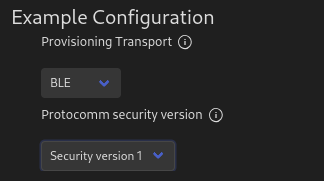

<style>
  .columnImages {
    float: left;
    padding: 5px;
    height:100%
  }

  .row::after {
    content: "";
    clear: both;
    display: table;
    width: 100%;
    height: 30%
  }
</style>


# Provisionamiento de credenciales WIFI

En este apartado llevaremos a cabo el aprovisionamiento de nuestra placa STM32 mediante el uso de diferentes aplicaciones móviles. Para poder llevar a cabo la realización del aprovisionamiento, vamos a ejecutar en nuestro SoC el ejemplo **examples/provisioning/wifi-prov-mgr**, el cuál será el encargado de gestionar la recepción de las credenciales desde nuestra aplicación móvil.

>Tarea
>
>Utilizando las aplicaciones correspondientes a tu dispositivo móvil, tanto para el uso de BLE como de SoftAP, provisiona tu ESP32 utilizando las credenciales que correspondan a tu red WiFi. Recuerda, antes de cada repetición del experimento, utilizar la orden idf.py erase_flash para eliminar información de provisionamiento de sesiones anteriores. Comprueba el funcionamiento de los distintos niveles de seguridad.
>
>Añade a tu informe las capturas de pantalla correspondientes a la salida del ESP32 que evidencien que el proceso de provisionamiento se ha realizado correctamente.

## Provisionamiento mediante BLE con seguridad

Para realizar el provisionamiento mediante BLE, tanto con seguridad como sin ella, utilizaremos la siguiente aplicación móvil:


Antes de poner a correr cualquiera de los dos extremos (el SoC utilizado por un lado y nuestro dispositivo móvil por el otro), necesitaremos configurar adecuadamente tanto la aplicación de nuestro dispositivo móvil como el ejemplo que se ejecutará en nuestra placa STM32. En las siguientes imágenes se puede observar tanto la configuración especificada en el ejemplo **wifi-prov-mgr** ejecutado en el SoC mediante el menú de configuración (izquierda), como la establecida en la aplicación móvil utilizada para llevar a cabo el provisionamiento mediante BLE (derecha).

<div class="row">
  <div class="columnImages" style="widh:50%; margin-left:10%">
    
  </div>

  <div class="columnImages" style="width:19%; float: right; margin-right:10%">
    
  </div>
</div>

Conforme podemos ver en la configuración de ambos equipo, debemos tener en cuenta:
 - El tipo de provisionamiento soportado en ambos dispositivos es BLE.
 - El nivel de seguridad establecido es nivel 2, es decir, se llevará a cabo un cifrado entre ambos extremos.
 - El número máximo de reintentos efectuados antes del provisionamiento serán 5.

Una vez llevada a cabo la configuración previa, realizaremos una limpieza de la posible información de provisionamiento establecida anteriormente en nuestro SoC mediante la herramienta **idf.py erase_flash** (acción que deberemos repetir cada vez que se realiza un nuevo provisionamiento) y ejecutaremos el programa de ejemplo **wifi-prov-mgr**. En los siguientes cuadros podemos ver las salidas obtenidas en cada uno de los pasos indicados, respectivamente.

```BASH
debian12:~$ idf.py erase_flash
Warning: Command "erase_flash" is deprecated since v4.4 and will be removed in next major release. Have you wanted to run "erase-flash" instead?
Executing action: erase_flash
CMakeLists.txt not found in project directory /home/mario
```

```BASH
I (910) BTDM_INIT: BT controller compile version [f6018c5]
I (920) BTDM_INIT: Bluetooth MAC: 24:0a:c4:ea:36:b6
I (1160) protocomm_nimble: BLE Host Task Started
I (1170) wifi_prov_mgr: Provisioning started with service name : PROV_EA36B4 
I (1170) app: Provisioning started
I (1170) app: Scan this QR code from the provisioning application for Provisioning.
I (1180) QRCODE: Encoding below text with ECC LVL 0 & QR Code Version 10
I (1180) QRCODE: {"ver":"v1","name":"PROV_EA36B4","username":"wifiprov","pop":"abcd1234","transport":"ble"}
I (1200) NimBLE: GAP procedure initiated: advertise; 
I (1200) NimBLE: disc_mode=2
I (1200) NimBLE:  adv_channel_map=0 own_addr_type=0 adv_filter_policy=0 adv_itvl_min=256 adv_itvl_max=256
I (1210) NimBLE: 

                                          
  █▀▀▀▀▀█ ▄▀ ▄█▀██▄  ▀▀ ▄█ ▀███ █▀▀▀▀▀█   
  █ ███ █ ▀███▀ ▄█▀▀ █▄ ███  █▀ █ ███ █   
  █ ▀▀▀ █ █▄ ▄ █▀█▀ ▄▄▀▀▄▀▄▀██  █ ▀▀▀ █   
  ▀▀▀▀▀▀▀ █▄▀ █ █ █▄▀ ▀▄▀▄▀ ▀▄▀ ▀▀▀▀▀▀▀   
  █▀ █▄ ▀▀ ▄█▄ █  ▀▄▀ ▀█▄ ███   ██▀▄▀█▄   
  ▄█▀▄▄█▀ ▀ ▀  ▄█  ▀▀█▀█▀▄██    ▄█▄▄▀ █   
  █▀▄▀▄▀▀█▄▄▄▄██▄▀▄▀▀▄███ █▀▄▄▀▄█  █  █   
  █▀▄▄ ▄▀▄▀ ▄ █▄█ ▀█  ▀█▀█ █▄ ███▀ ▄  ▀   
   ▀▀▀▄▀▀██ ▄▀ ▀█  ▀▀▀▀▀ ██▄▄ ▀█▀▀▄▄▀▀█   
  ██▀▄▄▀▀▀ ▀▀▄ █ ▄▀█▀▄▀▄▄ ▄ ▄ ▄▄▀██ ▄██   
   ▄▀▄▄▀▀▄█████▄▀ ▄▄▄ ▄█▀▀▄██   ▀ ▀▀  █   
  ▀▀ █ █▀▄▀█▀███▀    █▄█ ▄▀▄█▄▀ █▄█▄▀▀█   
  ▀   ▄ ▀█▄ ▄█ ▄█  █▄▄██  ▀█ ▄▀█▀▄ █▄▄█   
  ▀▄▄▀▀█▀▀▄█ █ ▀▀ ▄▄▀  ▄▀▀▀█▀▄▄ ▄ ██▀▀█   
  ▀▀    ▀ █▀█ ██▄▀▄▀ ▀█▀▀█ ▄▄▄█▀▀▀█▄▀▄▄   
  █▀▀▀▀▀█ ▀ ▀▀█ █▄█▄█▄▀█  ▀ █ █ ▀ █▄▄██   
  █ ███ █ ▄▄▀▄  ▄ ▄  ▀▀█▄▀▀▀▀ █▀▀██ ▄▀    
  █ ▀▀▀ █ ▄▀    ▄ ▀▀ ▀█▄  ▄█ ▀▀█▀▄▀▄ ▀▀   
  ▀▀▀▀▀▀▀ ▀ ▀ ▀    ▀  ▀▀▀ ▀▀ ▀▀   ▀  ▀▀   
                                          

I (1480) app: If QR code is not visible, copy paste the below URL in a browser.
https://espressif.github.io/esp-jumpstart/qrcode.html?data={"ver":"v1","name":"PROV_EA36B4","username":"wifiprov","pop":"abcd1234","transport":"ble"}
```

Observamos que se ha generado el código QR necesario para realizar el aprovisionamiento, además de como se especifica información a cerca de la configuración establecida para el mismo, como el tipo de transporte o el nombre de identificación del dispositivo. En el caso de duda, se puede replicar el código obtenido mediante el enlace que se encuentra justo después del mismo.

Una vez generado nuestro medio de enlace entre el dispositivo y el provisionador, escaneamos el código QR con la aplicación utilizada con el objetivo de establecer el enlace entre ambas partes. En este momento nuestro teléfono móvil y el SoC se encuentran conectados y la espera de que el primero le trasmita las claves de provisionamiento al segundo. 

En el siguiente cuadro podemos ver la salida que nos devuelve el SoC al realizar dicha conexión con el provisionador, en la cual nos especifica que se está utilizando el protocolo BLE y como se esta realizando un cifrado mediante claves, a la vez que se ha verificado la clave pública utilizada.

```BASH
I (20350) app: BLE transport: Connected!
I (21440) protocomm_nimble: mtu update event; conn_handle=0 cid=4 mtu=256
I (22550) security2: Using salt and verifier to generate public key...
I (23180) app: Secured session established!
```

Llegados a este punto, necesitaremos seleccionar en la aplicación de provisionamiento aquella red WIFI a la cual queremos conectar el dispositivo provisionado, en nuestro caso la STM32. De este modo, la aplicación le transmitirá las credenciales tanto de identificación como de acceso a la red WIFI y este podrá conectarse a la misma. En la siguiente imagen podemos ver la selección de redes WIFI disponibles, entre las cuales utilizaremos nuestra red de pruebas **RPI1_test**.


Una vez seleccionada la red WIFI con la que queremos realizar la conexión (y aportadas las credenciales de acceso en el caso de ser necesario), la aplicación de provisionamiento transmitirá dicha información al SoC, el cual realizará automáticamente la conexión con la red que anteriormente hemos indicado. En el siguiente cuadro podemos ver la salida obtenida por el puerto serie cuando el SoC recibe las credenciales de acceso para poder conectarse a la red WIFI.

Podemos ver como tanto el SSID como la contraseña coinciden con las credenciales especificadas en nuestra red WIFI de prueba. Finalmente, una vez se ha realizando la conexión con dicha web, la aplicación nos muestra tanto la dirección IP como la máscara obtenida desde el Punto de Acceso que proporciona servicio a dicha red.


```BASH
I (176540) wifi:<ba-add>idx:0 (ifx:0, ca:df:8d:9a:30:e2), tid:0, ssn:0, winSize:64
I (176580) wifi:AP's beacon interval = 102400 us, DTIM period = 2
I (177520) app: Connected with IP Address:192.168.43.198
I (177520) esp_netif_handlers: sta ip: 192.168.43.198, mask: 255.255.255.0, gw: 192.168.43.1
I (177520) wifi_prov_mgr: STA Got IP
I (177530) app: Provisioning successful
I (177530) app: Hello World!
I (178530) app: Hello World!
I (23180) app: Secured session established!
I (170850) app: Received Wi-Fi credentials
        SSID     : RPI1_test
        Password : test1234
I (175240) wifi:new:<13,0>, old:<1,0>, ap:<255,255>, sta:<13,0>, prof:1
I (176430) wifi:state: init -> auth (b0)
I (176440) wifi:state: auth -> assoc (0)
I (176450) wifi:state: assoc -> run (10)
I (176500) wifi:connected with RPI1_test, aid = 1, channel 13, BW20, bssid = ca:df:8d:9a:30:e2
I (176500) wifi:security: WPA2-PSK, phy: bgn, rssi: -39
I (176510) wifi:pm start, type: 1

I (176540) wifi:<ba-add>idx:0 (ifx:0, ca:df:8d:9a:30:e2), tid:0, ssn:0, winSize:64
I (176580) wifi:AP's beacon interval = 102400 us, DTIM period = 2
I (177520) app: Connected with IP Address:192.168.43.198
I (177520) esp_netif_handlers: sta ip: 192.168.43.198, mask: 255.255.255.0, gw: 192.168.43.1
I (177520) wifi_prov_mgr: STA Got IP
I (177530) app: Provisioning successful
I (177530) app: Hello World!
I (178530) app: Hello World!
```

Una vez que el SoC ha obtenido la dirección IP de la red a la cual se ha conectado, este cerrará la conexión con la aplicación de provisionamiento. En el siguiente cuadro podemos ver la salida generada por dicha desconexión, la cual se produce de manera automática después de la salida anterior y pone punto y final al proceso de provisionamiento.

```BASH
I (179300) NimBLE: GAP procedure initiated: stop advertising.

I (179300) NimBLE: GAP procedure initiated: stop advertising.

I (179300) NimBLE: GAP procedure initiated: terminate connection; conn_handle=0 hci_reason=19

E (179370) protocomm_nimble: Error setting advertisement data; rc = 30
I (179380) wifi_prov_mgr: Provisioning stopped
I (179380) app: BLE transport: Disconnected!
I (179380) app: BLE transport: Disconnected!
I (179390) wifi_prov_scheme_ble: BTDM memory released
I (179530) app: Hello World!
I (180530) app: Hello World!
I (181530) app: Hello World!
I (182530) app: Hello World!
```

## Provisionamiento mediante BLE sin seguridad

Para llevar a cabo el provisionamiento sin seguridad, deberemos configurar nuestro proyecto **wifi-prov-mgr** para que utilice el nivel 1 de seguridad durante el proceso, mediante el uso del menú de configuración. Esto quiere decir que las credenciales enviadas desde el provisionador se realizarán en texto plano, lo cual puede llegar a suponer una importante brecha de seguridad para la red a la cual se quiere llevar a cabo el acceso.

En la siguiente imagen podemos ver la configuración establecida para la aplicación del SoC. Destacar que salvo el nivel de seguridad empleado, el resto de opciones permanecen iguales que en el apartado anterior.



Una vez establecida la configuración adecuada, el proceso de provisionamiento se produce igual que el descrito en el caso anterior y con una salida muy semejante. Sin embargo, cuando realizamos la conexión entre ambos puntos, podemos ver como la salida no nos indica que se este empleando ningún tipo de cifrado (al contrario que cuando utilizamos el nivel 2 de seguridad).


```C
I (14950) app: BLE transport: Connected!
I (15960) protocomm_nimble: mtu update event; conn_handle=0 cid=4 mtu=256
I (17200) app: Secured session established!
```

Para finalizar, podemos ver como una vez llevado a cabo el provisionamiento y obtención de credenciales WIFI, también se lleva a cabo la desconexión entre ambas partes y el SoC permanece conectado a la nueva red.

```BASH
I (69030) app: Received Wi-Fi credentials
        SSID     : RPI1_test
        Password : test1234
I (73410) wifi:new:<10,0>, old:<1,0>, ap:<255,255>, sta:<10,0>, prof:1
I (74600) wifi:state: init -> auth (b0)
I (74610) wifi:state: auth -> assoc (0)
I (74620) wifi:state: assoc -> run (10)
I (74670) wifi:connected with RPI1_test, aid = 1, channel 10, BW20, bssid = ca:df:8d:9a:30:e2
I (74670) wifi:security: WPA2-PSK, phy: bgn, rssi: -36
I (74680) wifi:pm start, type: 1

I (74710) wifi:<ba-add>idx:0 (ifx:0, ca:df:8d:9a:30:e2), tid:0, ssn:0, winSize:64
I (74720) wifi:AP's beacon interval = 102400 us, DTIM period = 2
I (75690) app: Connected with IP Address:192.168.43.198
I (75690) esp_netif_handlers: sta ip: 192.168.43.198, mask: 255.255.255.0, gw: 192.168.43.1
I (75690) wifi_prov_mgr: STA Got IP
I (75700) app: Provisioning successful
I (75700) app: Hello World!
I (76700) app: Hello World!
I (77510) NimBLE: GAP procedure initiated: stop advertising.

I (77510) NimBLE: GAP procedure initiated: stop advertising.

I (77520) NimBLE: GAP procedure initiated: terminate connection; conn_handle=0 hci_reason=19

E (77590) protocomm_nimble: Error setting advertisement data; rc = 30
I (77600) wifi_prov_mgr: Provisioning stopped
I (77600) app: BLE transport: Disconnected!
I (77600) app: BLE transport: Disconnected!
I (77600) wifi_prov_scheme_ble: BTDM memory released
I (77700) app: Hello World!
I (78700) app: Hello World!
I (79700) app: Hello World!
```


## Provisionamiento mediante SoftAp con seguridad

Para realizar el provisionamiento mediante SoftAP, tanto con seguridad como sin ella, utilizaremos la siguiente aplicación móvil:


Ambas aplicaciones son muy parecidas por lo que el proceso a llevar a cabo para realizar el provisionamiento será muy similar con ambas. Dicho esto y de igual manera que en el caso anterior, el primer paso será llevar a cabo la configuración correcta de ambos extremos.  En las siguientes imágenes se puede ver tanto la configuración del SoC (izquierda), como la establecida en la aplicación móvil utilizada para llevar a cabo el provisionamiento mediante SoftAP (derecha).

<div class="row">
  <div class="columnImages" style="width:50%; margin-left:10%">
    
  </div>

  <div class="columnImages" style="width:17%; float: right; margin-right:10%">
    
  </div>
</div>

Podemos ver como la configuración utilizada es, en esencia, la misma que la empleada para el provisionamiento mediante BLE, con la única diferencia de que se ha establecido la opción SoftAP en ambos extremos. 

Una vez establecida la configuración seleccionando el modo de uso con cifrado de seguridad y habiendo limpiado la memoria del SoC, podemos ver que al iniciar la aplicación obtenemos una salida con unos detalles un poco diferentes. En el siguiente cuadro podemos ver la salida inicial obtenida del SoC antes de realizar el enlace entre ambos puntos, y como en las primeras líneas no indica el uso de un cifrado de seguridad.

```BASH
I (725) app: Starting provisioning
I (735) app: Development mode: using hard coded salt
I (735) app: Development mode: using hard coded verifier
I (745) phy_init: phy_version 4771,450c73b,Aug 16 2023,11:03:10
I (825) wifi:mode : sta (24:0a:c4:ea:36:b4)
I (825) wifi:enable tsf
I (835) wifi:mode : sta (24:0a:c4:ea:36:b4) + softAP (24:0a:c4:ea:36:b5)
I (835) wifi:Total power save buffer number: 16
I (835) wifi:Init max length of beacon: 752/752
I (845) wifi:Init max length of beacon: 752/752
I (845) esp_netif_lwip: DHCP server started on interface WIFI_AP_DEF with IP: 192.168.4.1
I (845) wifi:Total power save buffer number: 16
I (865) esp_netif_lwip: DHCP server started on interface WIFI_AP_DEF with IP: 192.168.4.1
I (865) wifi_prov_mgr: Provisioning started with service name : PROV_EA36B4 
I (875) app: Provisioning started
I (885) app: Scan this QR code from the provisioning application for Provisioning.
I (885) QRCODE: Encoding below text with ECC LVL 0 & QR Code Version 10
I (895) QRCODE: {"ver":"v1","name":"PROV_EA36B4","username":"wifiprov","pop":"abcd1234","transport":"softap"}
                                          
  █▀▀▀▀▀█ ▄▄█  ███   ▀▀ ▄█ ▀███ █▀▀▀▀▀█   
  █ ███ █ ▀▄  ▄ ███▀ █▄ ███  █▀ █ ███ █   
  █ ▀▀▀ █ █▀█ █▀▀█▀ ▄▄▀▀▄▀▄▀██  █ ▀▀▀ █   
  ▀▀▀▀▀▀▀ █ █▄▀ ▀ █▄▀ ▀▄▀▄▀ ▀▄▀ ▀▀▀▀▀▀▀   
  █▀▄█  ▀▀▄▄ ████ ▀▄▀ ▀█▄ ███   ██▀▄▀█▄   
  ▀▀   ▀▀ ▄█ ███▄  ▀▀█▀█▀▄██    ▄█▄▄▀ █   
   █▄▀ █▀▀  ██ ▀ ▀▄▀▀▄███ █▀▄▄▀▄█  █  █   
   ▀▀▀▄▀▀▄ ▄██ ▄▄ ▀█  ▀█▀█ █▄ ███▀ ▄  ▀   
   ▀▄▀█▀▀▄▀   █▄   ▀▀▀▀▀ ██▄▄ ▀█▀▀▄▄▀▀█   
  ▀  █▄▀▀▀▄██▀█ ▀▄▀█▀▄▀▄▄ ▄ ▄ ▄▄▀██ ▄██   
  ▄▀█▄▀█▀  █▄▄ █  ▄▄▄ ▄█▀▀▄██   ▀ ▀▀  █   
  ██▀ █▄▀▄██▀  ▄█    █▄█ ▄▀▄█▄▀ █▄█▄▀▀█   
   █▀▄▄▀▀ ▀▀█▄██▄  █▄▄██  ▀█ ▄▀█▀▄ █▄▄█   
  ▀▄▄▄▀█▀▄▀ ▄ █▄█ ▄▄▀  ▄▀▀▀█▀▄▄ ▄ ██▀▀█   
  ▀▀ ▀▀▀▀▀█▄▄▀ ▀█▀▄▀ ▀█▀▀█ ▄▄▄█▀▀▀█▄▀▄▄   
  █▀▀▀▀▀█ ▀██▄ █ ▄█▄█▄▀█  ▀ █ █ ▀ █▄▄▀▀   
  █ ███ █ ▄▀ ██▄▀ ▄  ▀▀█▄▀▀▀▀ █▀▀██ ▄     
  █ ▀▀▀ █ ▄▀ ███▀ ▀▀ ▀█▄  ▄█ ▀▀█▀▄▀▄ ▀▀   
  ▀▀▀▀▀▀▀ ▀▀ ▀  ▀  ▀  ▀▀▀ ▀▀ ▀▀   ▀  ▀▀   
                                          

I (1165) app: If QR code is not visible, copy paste the below URL in a browser.
https://espressif.github.io/esp-jumpstart/qrcode.html?data={"ver":"v1","name":"PROV_EA36B4","username":"wifiprov","pop":"abcd1234","transport":"softap"}

```

Si analizamos la salida obtenida, podemos ver las siguientes diferencias con respecto al modo de provisionamiento mediante BLE:
 - Se india que se ha iniciado el WIFI en modo combinado con las direcciones MAC  **24:0a:c4:ea:36:b4** para Estación y **24:0a:c4:ea:36:b5** para Punto de Acceso.
 - Se ha iniciado el protocolo DHCP en la interfaz **WIFI_AP_DEF** con dirección IP **192.168.4.1**.
 - También nos indica el modo de codificación utilizado, siendo en este caso **ECC LVL 0 & QR Code Version 10**.

 En este caso, y a diferencia de lo realizado en el modo BLE, una vez escaneado el código QR devuelto por el SoC necesitaremos seleccionar el identificador del dispositivo para llevar a cabo el provisionamiento. En la siguiente imagen podemos ver la interfaz de selección indicada.

 

Una vez realizada la conexión entre los puntos y aportadas las credenciales para la realización del provisionamiento, podemos ver como la salida obtenida desde el SoC sigue los mismos pasos en la conexión mediante BLE. Esto incluye tanto la conexión con al red WIFI, cuyos parámetros de acceso hemos provisionado, como la desconexión del programa de provisionamiento una vez que dicha conexión se ha llevado a cabo correctamente.

En el siguiente cuadro podemos ver la salida obtenida desde el SoC una vez se ha llevado a cabo el provisionamiento:

```BASH
I (29965) wifi:new:<1,0>, old:<1,1>, ap:<1,1>, sta:<0,0>, prof:1
I (29965) wifi:station: 66:9f:f1:96:ee:8c join, AID=1, bgn, 20
I (29965) app: SoftAP transport: Connected!
I (30085) wifi:<ba-add>idx:2 (ifx:1, 66:9f:f1:96:ee:8c), tid:0, ssn:0, winSize:64
I (30205) esp_netif_lwip: DHCP server assigned IP to a client, IP is: 192.168.4.2
I (30855) security2: Using salt and verifier to generate public key...
I (31175) app: Secured session established!
I (66435) app: Received Wi-Fi credentials
        SSID     : RPI1_test
        Password : test1234
I (70285) wifi:primary chan differ, old=1, new=1, start CSA timer
I (70285) wifi:new:<1,1>, old:<1,0>, ap:<1,1>, sta:<1,0>, prof:1
I (72435) wifi:state: init -> auth (b0)
I (72445) wifi:state: auth -> assoc (0)
I (72495) wifi:state: assoc -> run (10)
I (72515) wifi:connected with RPI1_test, aid = 2, channel 1, BW20, bssid = ca:df:8d:9a:30:e2
I (72515) wifi:security: WPA2-PSK, phy: bgn, rssi: -34
I (72535) wifi:pm start, type: 1

I (72545) wifi:AP's beacon interval = 102400 us, DTIM period = 2
I (72555) wifi:<ba-add>idx:0 (ifx:0, ca:df:8d:9a:30:e2), tid:0, ssn:0, winSize:64
I (73545) app: Connected with IP Address:192.168.43.198
I (73545) esp_netif_handlers: sta ip: 192.168.43.198, mask: 255.255.255.0, gw: 192.168.43.1
I (73545) wifi_prov_mgr: STA Got IP
I (73545) app: Provisioning successful
I (73555) app: Hello World!
I (73685) wifi:station: 66:9f:f1:96:ee:8c leave, AID = 1, bss_flags is 134243, bss:0x3ffca644
I (73685) wifi:new:<1,0>, old:<1,1>, ap:<1,1>, sta:<1,0>, prof:1
I (73695) wifi:<ba-del>idx:2, tid:0
I (73695) app: SoftAP transport: Disconnected!
I (74555) app: Hello World!
I (74745) wifi:mode : sta (24:0a:c4:ea:36:b4)
I (74755) wifi_prov_mgr: Provisioning stopped
I (75555) app: Hello World!
I (76555) app: Hello World!
I (77555) app: Hello World!
I (78555) app: Hello World!
```

## Provisionamiento mediante SoftAp sin seguridad

De la misma manera que hemos realizado en el apartado de provisionamiento mediante BLE, para poder llevar a cabo el modo de provisionamiento SoftAP sin seguridad necesitaremos configurar el **nivel de seguridad 1** mediante el menú de configuración del proyecto (manteniendo en este caso, el modo de provisionamiento mediante SoftAP). En la siguiente imagen podemos ver dicha configuración:


Una vez establecida la configuración y llevada a cabo la conexión en nuestro SoC, podemos ver como se vuelven a establecer adecuadamente las direcciones MAC de los modos de operación pero, a diferencia del caso anterior, esta vez no nos indica nada a cerca del cifrado de datos. En la siguiente imagen podemos ver la sección de salida que se corresponde a los mencionado:

```BASH
I (725) app: Starting provisioning
I (735) phy_init: phy_version 4771,450c73b,Aug 16 2023,11:03:10
I (815) wifi:mode : sta (24:0a:c4:ea:36:b4)
I (815) wifi:enable tsf
I (825) wifi:mode : sta (24:0a:c4:ea:36:b4) + softAP (24:0a:c4:ea:36:b5)
```

Una vez indicado esto, el resto del proceso sigue las mismas pautas que las realizadas en el apartado anterior, obteniendo una salida equivalente y llevando a cabo la conexión a la red WIFI y la desconexión del provisionador. En el siguiente cuadro podemos ver la salida obtenida desde nuestro SoC:

```BASH
I (22325) wifi:new:<1,0>, old:<1,1>, ap:<1,1>, sta:<0,0>, prof:1
I (22335) wifi:station: 66:9f:f1:96:ee:8c join, AID=1, bgn, 20
I (22335) app: SoftAP transport: Connected!
I (22485) wifi:station: 66:9f:f1:96:ee:8c leave, AID = 1, bss_flags is 134243, bss:0x3ffca3fc
I (22485) wifi:new:<1,0>, old:<1,0>, ap:<1,1>, sta:<0,0>, prof:1
I (22485) app: SoftAP transport: Disconnected!
I (22655) wifi:new:<1,0>, old:<1,0>, ap:<1,1>, sta:<0,0>, prof:1
I (22655) wifi:station: 66:9f:f1:96:ee:8c join, AID=1, bgn, 20
I (22655) app: SoftAP transport: Connected!
I (22855) wifi:<ba-add>idx:2 (ifx:1, 66:9f:f1:96:ee:8c), tid:0, ssn:0, winSize:64
I (22915) esp_netif_lwip: DHCP server assigned IP to a client, IP is: 192.168.4.2
I (24095) app: Secured session established!
I (41335) app: Received Wi-Fi credentials
        SSID     : RPI1_test
        Password : test1234
I (45175) wifi:primary chan differ, old=1, new=1, start CSA timer
I (45175) wifi:new:<1,1>, old:<1,0>, ap:<1,1>, sta:<1,0>, prof:1
I (47125) wifi:state: init -> auth (b0)
I (47135) wifi:state: auth -> assoc (0)
I (47155) wifi:state: assoc -> run (10)
I (47195) wifi:connected with RPI1_test, aid = 4, channel 1, BW20, bssid = ca:df:8d:9a:30:e2
I (47195) wifi:security: WPA2-PSK, phy: bgn, rssi: -39
I (47205) wifi:pm start, type: 1

I (47215) wifi:<ba-add>idx:0 (ifx:0, ca:df:8d:9a:30:e2), tid:0, ssn:0, winSize:64
I (47245) wifi:AP's beacon interval = 102400 us, DTIM period = 2
I (48215) app: Connected with IP Address:192.168.43.198
I (48215) esp_netif_handlers: sta ip: 192.168.43.198, mask: 255.255.255.0, gw: 192.168.43.1
I (48215) wifi_prov_mgr: STA Got IP
I (48225) app: Provisioning successful
I (48225) app: Hello World!
I (49225) app: Hello World!
I (49435) wifi:station: 66:9f:f1:96:ee:8c leave, AID = 1, bss_flags is 134243, bss:0x3ffca488
I (49435) wifi:new:<1,0>, old:<1,1>, ap:<1,1>, sta:<1,0>, prof:1
I (49435) wifi:<ba-del>idx:2, tid:0
I (49435) app: SoftAP transport: Disconnected!
I (50225) app: Hello World!
I (50495) wifi:mode : sta (24:0a:c4:ea:36:b4)
I (50505) wifi_prov_mgr: Provisioning stopped
I (51225) app: Hello World!
I (52225) app: Hello World!
I (53225) app: Hello World!
I (54225) app: Hello World!
```