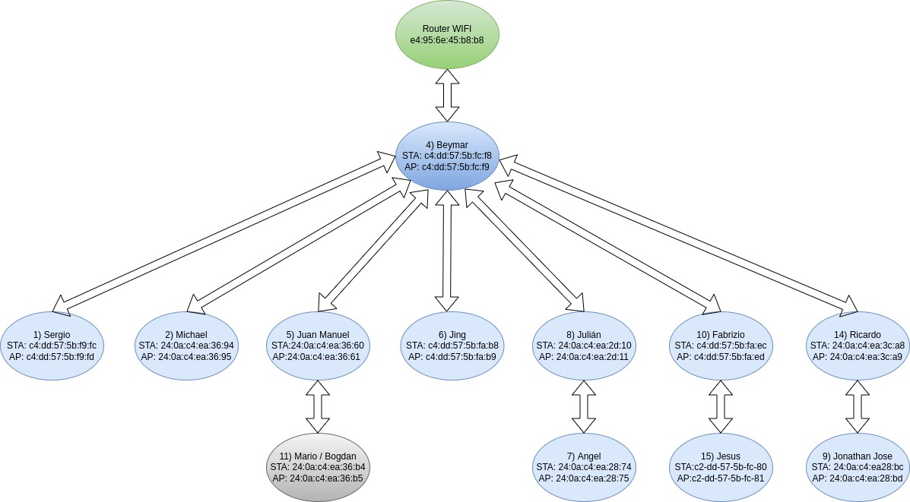
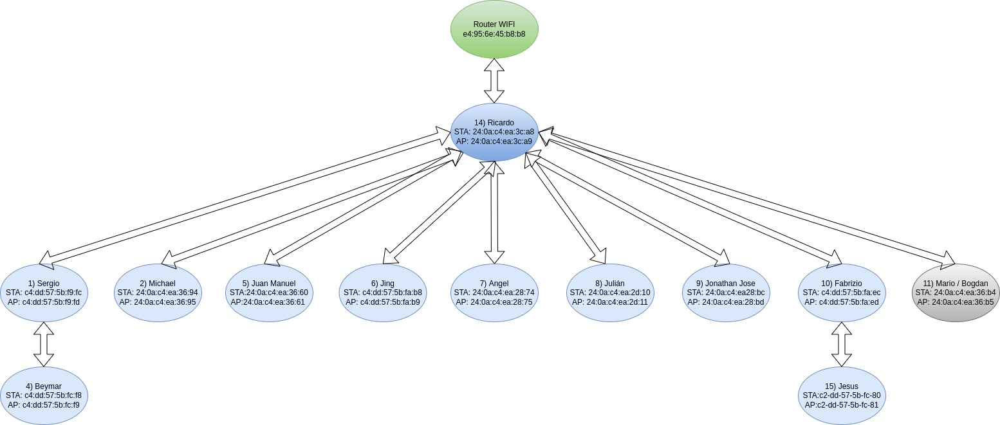
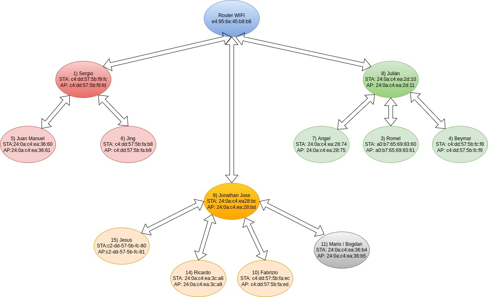

# Despliegue de una red WIFI Mesh

En el actual proyecto vamos a realizar el despliegue de una red WIFI Mesh de pequeñas dimensiones, la cuál contará con un total de 12 nodos, sin incluir el router WIFI al cuál estará conectado el nodo raíz. Para esto vamos a utilizar el ejemplo **mesh/internal_communication** y configuraremos cada uno de los nodos para que intenten conectarse a la misma red WIFI, además de proporcionar las credenciales necesarias para que puedan formar parte de la misma red Mesh.

Una vez ejecutamos el programa de ejemplo, este nos muestra las direcciones MAC correspondientes a nuestro nodo, tanto para su funcionamiento como estación (utilizada para conectarse a otros nodos de las capas superiores de la red Mesh) como Punto de Acceso (empleada por aquellos nodos de la red Mesh que quieran conectarse a nosotros desde las capas inferiores). En la siguiente imagen podemos ver la salida inicial de la ejecución del programa, donde se nos muestran dichas direcciones MAC:
 - MAC STA: 24:0a:c4:ea:36:b4
 - MAC AP: 24:0a:c4:ea:36:b5

```BASH
I (882) wifi:mode : sta (24:0a:c4:ea:36:b4) + softAP (24:0a:c4:ea:36:b5)
I (882) wifi:enable tsf
I (892) wifi:Total power save buffer number: 16
I (892) wifi:Init max length of beacon: 752/752
I (892) wifi:Init max length of beacon: 752/752
I (892) mesh: <nvs>read layer:0, err:0x1102
I (902) mesh: <nvs>read assoc:0, err:0x1102
I (902) wifi:Set ps type: 1, coexist: 0

I (922) wifi:Total power save buffer number: 16
I (2082) wifi:mode : sta (24:0a:c4:ea:36:b4)
I (2102) mesh: <MESH_NWK_LOOK_FOR_NETWORK>need_scan:0x3, need_scan_router:0x0, look_for_nwk_count:1
```

Una vez que se ha logrado llevar a cabo la conexión de nuestro nodo con la red mesh que se está formando, podemos ver como este ha pasado a pertenecer a la capa 3 y a conectarse a aquél nodo que tiene como dirección MAC de Punto de Acceso 24:0a:c4:ea:36:61. En el siguiente cuadro podemos ver la salida correspondiente:

```BASH
I (169682) mesh_main: layer:3, rtableSize:2, NODE
W (174542) wifi:(->sleep)busy, waked:1, dream:0, sleep:0
W (176092) mesh_main: [#RX:3/449][L:3] parent:24:0a:c4:ea:36:61, receive from c4:dd:57:5b:fc:f8, size:1460, heap:150884, flag:0[err:0x0, proto:0, tos:0]
W (178992) wifi:(->sleep)busy, waked:1, dream:0, sleep:0
```

Una vez se ha llegado a la convergencia de la red, en la siguiente imagen podemos ver como ha quedado la configuración de la misma, teniendo en cuenta que se está empleado en siguiente código de colores:
- <span style="color: #82B366;">Nodo del router WIFI.</span>
- <span style="color: #6C8EBF;">Nodo raíz de la red Mesh.</span>
- <span style="color: #DAE8FC;">Nodo intermedio u hoja de la red Mesh.</span>
- <span style="color: #B3B3B3;">Nodo de la red Mesh correspondiente a nuestro equipo.</span>




# Reconexión de la red Mesh tras la caída del nodo raíz

Tras la realización de la convergencia anterior, se va a llevar a cabo la desconexión forzosa del nodo raíz, haciendo que la red tenga que volver a debatir un nuevo nodo que supla su lugar proporcionando acceso al router WIFI. Basta decir que las direcciones MAC asignadas por cada uno de los nodos permanecerán invariantes respecto a al red anterior, por lo que únicamente tenemos que prestar atención a las nuevas conexiones que conformarán la estructura de la nueva red.

En la siguiente imagen podemos ver la salida de la ejecución que nos indica que estamos ocupando la capa 2 y que nos hemos conectado al nodo que tiene por dirección AMC de Punto de Acceso 24:0a:c4:ea:3c:a9, es decir, el nodo raíz.

```BASH
I (1029682) mesh_main: layer:2, rtableSize:1, NODE
W (1030752) wifi:(->sleep)busy, waked:1, dream:0, sleep:0
W (1031852) wifi:(->sleep)busy, waked:1, dream:0, sleep:0
W (1031912) mesh_main: [#RX:49/44][L:2] parent:24:0a:c4:ea:3c:a9, receive from 24:0a:c4:ea:3c:a8, size:1460, heap:149688, flag:0[err:0x0, proto:0, tos:0]
```

En la siguiente imagen podemos ver la estructura de la nueva red Mesh, una vez que esta ya ha llegado a la convergencia. Notar que el código de colores utilizado es el mismo que en el apartado anterior:



# Generación de multiples redes Mesh de menor tamaño

Para finalizar, vamos a dividir los diferentes nodos en grupos con el objetivo de llevar a cabo la realización de diferentes redes Mesh de menor tamaño. Para esto vamos a llevar a cabo la modificación del identificador de la rede Mesh a la cual nos vamos a conectar. En el siguiente cuadro podemos ver la modificación de dicho parámetro dentro del código ejecutado:

```C
/*******************************************************
 *                Variable Definitions
 *******************************************************/
static const char *MESH_TAG = "mesh_main";
static const uint8_t MESH_ID[6] = { 0x77, 0x77, 0x77, 0x77, 0x77, 0x06};
```

Una vez hecho esto y ejecutado nuevamente el ejemplo, podemos ver como nuestro equipo se une a la nueva red en la capa 2 a aquel nodo que tiene como dirección MAC de punto de acceso 24:0a:c4:ea:36:c9, el cual hace el trabajo de nodo raíz.

```BASH
I (49092) mesh_main: layer:2, rtableSize:1, NODE
W (50612) wifi:(->sleep)busy, waked:1, dream:0, sleep:0
W (50642) mesh_main: [#RX:23/459][L:2] parent:24:0a:c4:ea:36:c9, receive from 24:0a:c4:ea:36:c8, size:1460, heap:156736, flag:0[err:0x0, proto:0, tos:0]
```

En la siguiente imagen podemos ver la estructura de todas a las redes Mesh creadas y su conexión con el router WIFI empleado. En este caso se está empleado en siguiente código de colores:
- <span style="color: #6C8EBF;">Nodo del router WIFI.</span>
- <span style="color: #EA6B66;">Nodo raíz de la red Mesh 1.</span>
- <span style="color: #F8CECC;">Nodo intermedio u hoja de la red Mesh 1.</span>
- <span style="color: #97D077;">Nodo raíz de la red Mesh 2.</span>
- <span style="color: #D5E8D4;">Nodo intermedio u hoja de la red Mesh 2.</span>
- <span style="color: #FFA500;">Nodo raíz de la red Mesh 3.</span>
- <span style="color: #FFE6CC;">Nodo intermedio u hoja de la red Mesh 3.</span>
- <span style="color: #B3B3B3;">Nodo de la red Mesh correspondiente a nuestro equipo.</span>


