# Práctica 7 - BLE Mesh

## Modelo genérico ON-OFF

### Tarea

> Escribe un informe en el que describas cada una de las tareas propuestas, su desarrollo y los resultados obeservados, así como tus observaciones o comentarios personales.

#### El servidor ON-OFF

En el caso del servidor hemos partido del ejemplo `onoff_server`. En el mismo se ha utilizado `ESP32-WROOM-32` como elección en el parámetro de entrada para `Board selection`.

Para conectar los leds hemos visto el contenido del fichero `board.h` en el caso de la placa seleccionada:

```c
#define LED_R GPIO_NUM_25
#define LED_G GPIO_NUM_26
#define LED_B GPIO_NUM_27
```

Vemos que inicializa correctamente en el log.
También vemos la MAC bluetooth del servidor que necesitaremos más tarde:

```BASH
I (674) main_task: Calling app_main()
I (674) EXAMPLE: Initializing...
I (674) gpio: GPIO[25]| InputEn: 0| OutputEn: 0| OpenDrain: 0| Pullup: 1| Pulldown: 0| Intr:0
I (684) gpio: GPIO[26]| InputEn: 0| OutputEn: 0| OpenDrain: 0| Pullup: 1| Pulldown: 0| Intr:0
I (694) gpio: GPIO[27]| InputEn: 0| OutputEn: 0| OpenDrain: 0| Pullup: 1| Pulldown: 0| Intr:0
I (754) BTDM_INIT: BT controller compile version [946b762]
I (754) BTDM_INIT: Bluetooth MAC: 24:0a:c4:ea:28:c2
I (764) phy_init: phy_version 4670,719f9f6,Feb 18 2021,17:07:07
I (1244) EXAMPLE: ESP_BLE_MESH_PROV_REGISTER_COMP_EVT, err_code 0
I (1244) EXAMPLE: BLE Mesh Node initialized
I (1244) main_task: Returned from app_main()
I (1264) EXAMPLE: ESP_BLE_MESH_NODE_PROV_ENABLE_COMP_EVT, err_code 0
```

#### El cliente ON-OFF

De la misma manera que en el servidor seleccionamos `ESP32_WROOM-32` como valor del parámetro `Board selection`.

Salida del cliente:

```BASH
I (644) main_task: Calling app_main()
I (644) EXAMPLE: Initializing...
I (644) gpio: GPIO[25]| InputEn: 0| OutputEn: 0| OpenDrain: 0| Pullup: 1| Pulldown: 0| Intr:0
I (654) gpio: GPIO[26]| InputEn: 0| OutputEn: 0| OpenDrain: 0| Pullup: 1| Pulldown: 0| Intr:0
I (664) gpio: GPIO[27]| InputEn: 0| OutputEn: 0| OpenDrain: 0| Pullup: 1| Pulldown: 0| Intr:0
use esp timer !!!
E (674) esp_timer: Task is already initialized
I (684) gpio: GPIO[0]| InputEn: 1| OutputEn: 0| OpenDrain: 0| Pullup: 1| Pulldown: 0| Intr:3
I (734) BTDM_INIT: BT controller compile version [946b762]
I (734) BTDM_INIT: Bluetooth MAC: 8c:aa:b5:b8:bf:f6
I (734) phy_init: phy_version 4670,719f9f6,Feb 18 2021,17:07:07
I (1154) EXAMPLE_NVS: Open namespace done, name "mesh_example"
I (1244) EXAMPLE: ESP_BLE_MESH_PROV_REGISTER_COMP_EVT, err_code 0
I (1244) EXAMPLE_NVS: Restore, key "onoff_client", length 6
I (1244) EXAMPLE_NVS: Restore, data: 00 00 00 00 01 36
I (1244) EXAMPLE: Restore, net_idx 0x0000, app_idx 0x0000, onoff 1, tid 0x36
I (1254) EXAMPLE: BLE Mesh Node initialized
I (1264) main_task: Returned from app_main()
I (1274) EXAMPLE: ESP_BLE_MESH_NODE_PROV_ENABLE_COMP_EVT, err_code 0
```

#### Provisionamiento y control desde una aplicación móvil

- Primero descargamos la siguiente aplicación para Android [nRF Mesh](https://play.google.com/store/apps/details?id=no.nordicsemi.android.nrfmeshprovisioner&hl=en)

- Al abrir la aplicación y navegando a Network vemos que no hay ningún nodo provisionado. Pulsamos en [+] para añadir un nuevo nodo.

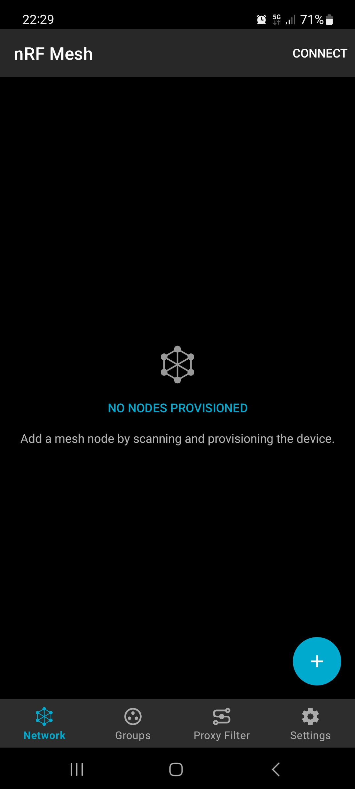

- Nos aparecen los dos nodos, servidor y cliente. Seleccionamos el que coincide con la mac del servidor `24:0a:c4:ea:28:c2`:
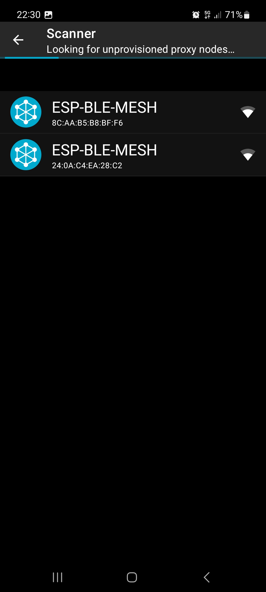

- Seleccionamos `Identify` y provisionamos el servidor:

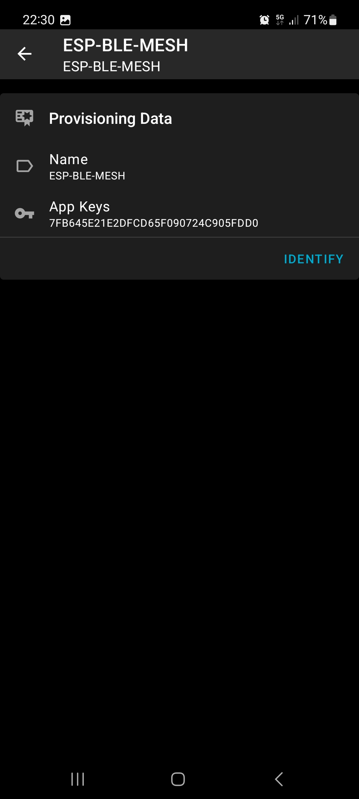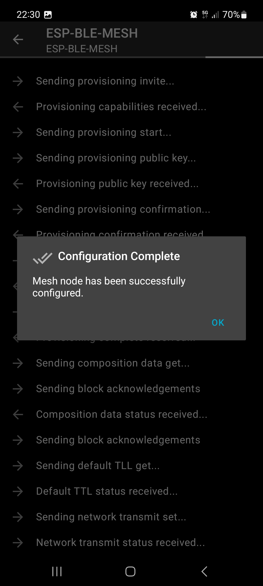

- Hacemos lo mismo con el cliente: 
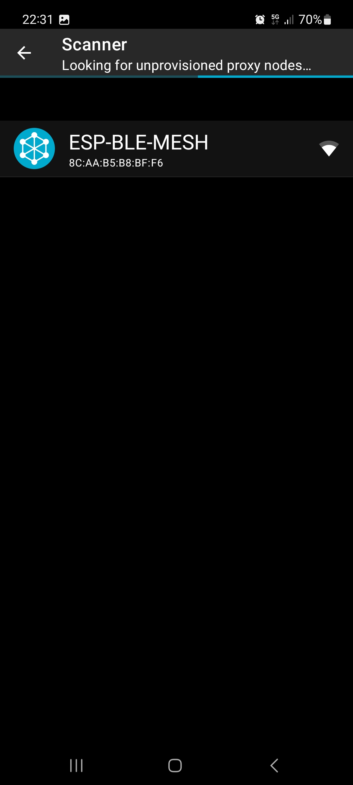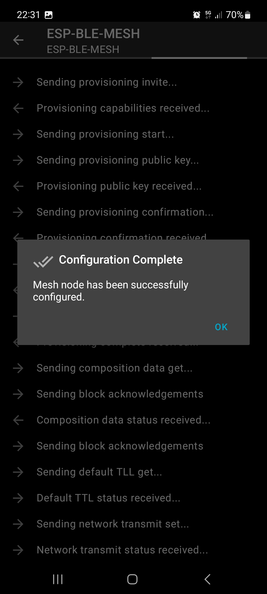

- Creamos un grupo en la pestaña de `Groups`:

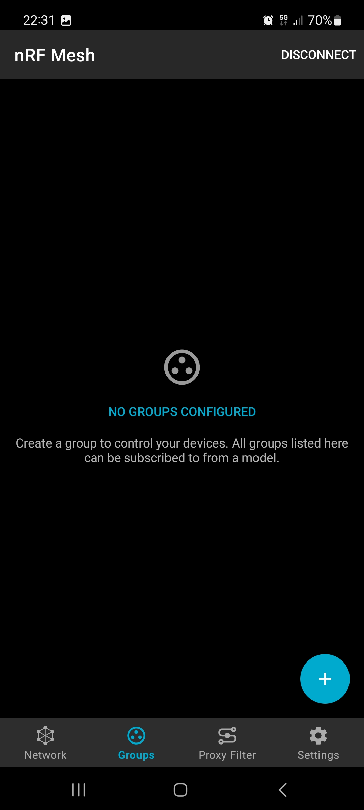
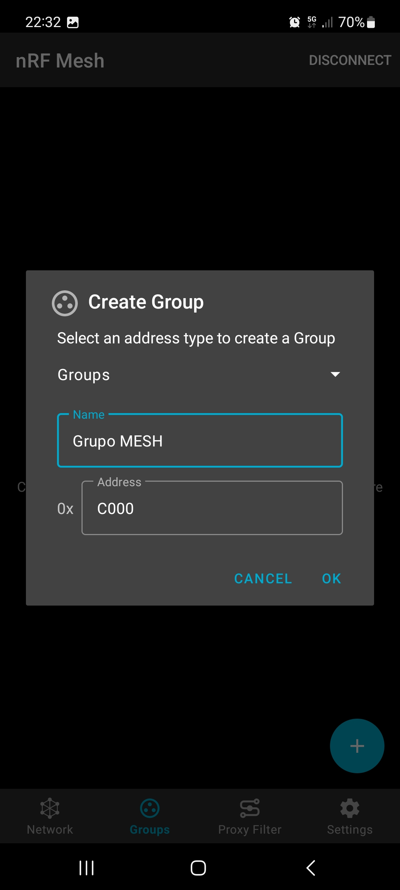

- Si pulsamos sobre el vemos que no hay ningún modelo suscrito al grupo:

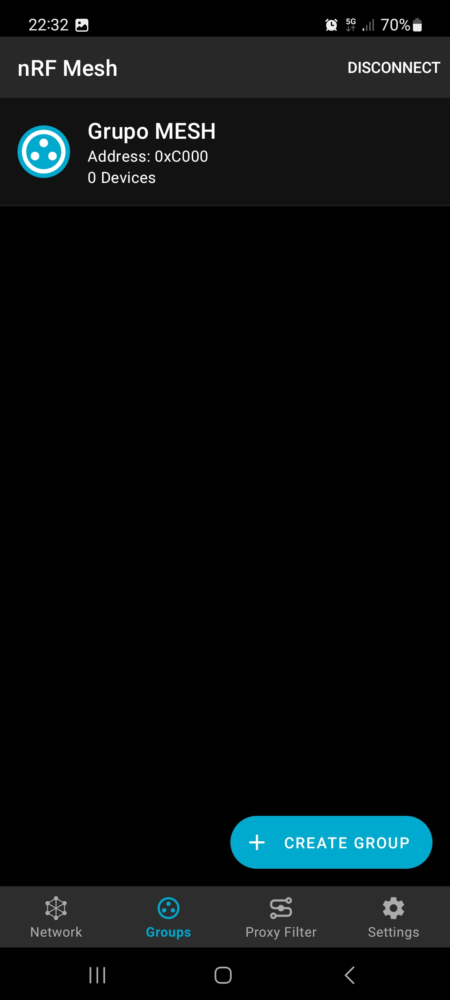
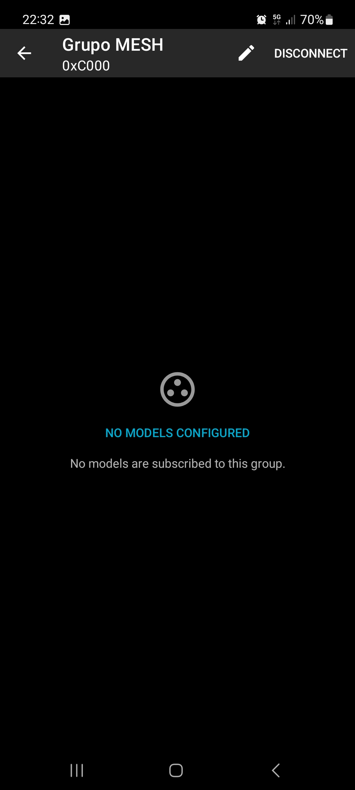

- Volvemos al apartado `Network` y seleccionamos el servidor que tiene 3 elementos. Por cada elemento nos suscribimos al modelo `Generic On Off Server` como sigue:

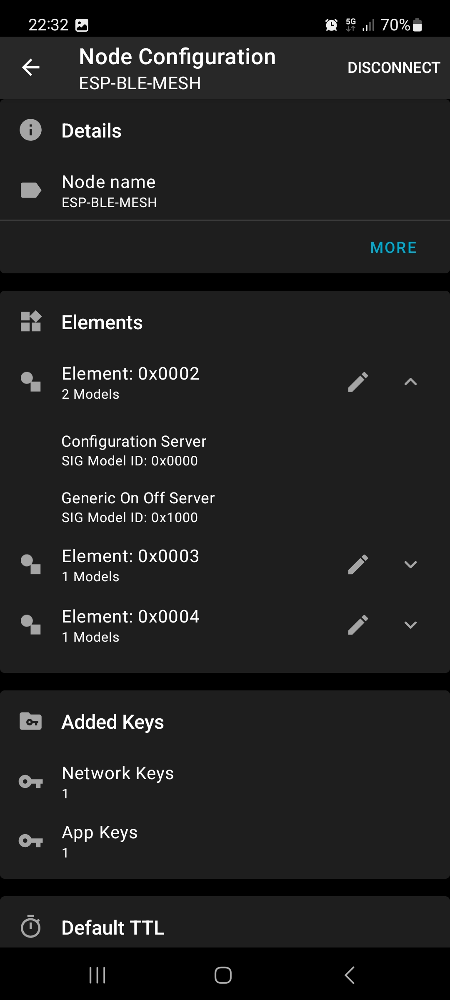

- Por cada uno de ellos hacemos seleccionamos `Bind Key` y `Subscribe`:

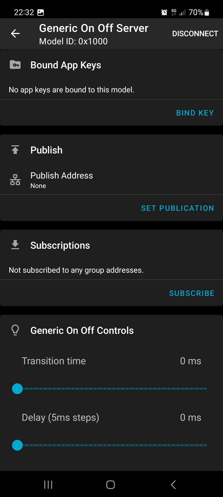

- Hacemos lo mismo con los modelos del cliente obteniendo al final estmos modelos en el `Grupo Mesh`.

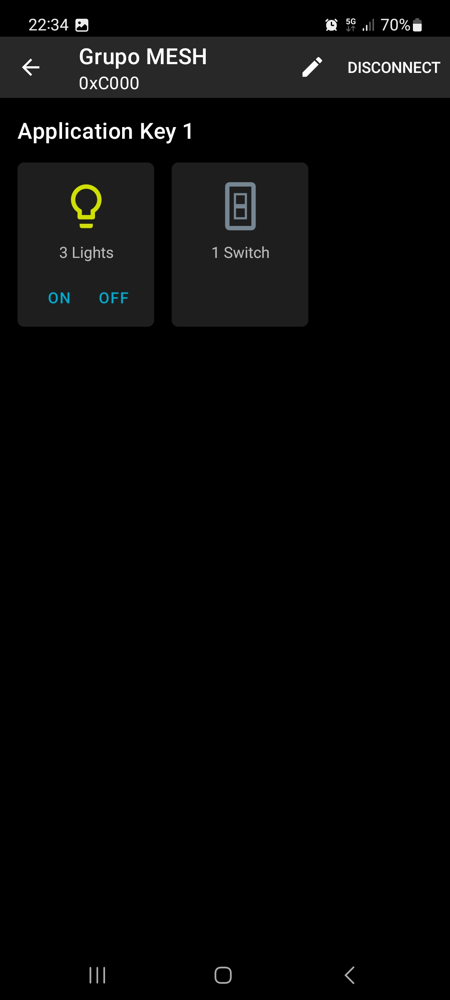

- Verificamos como la pulsación de `ON` `OFF` enciende y apaga los leds en la placa que actua como servidor respectivamente:

```BASH
I (2545984) EXAMPLE: event 0x02, opcode 0x8203, src 0x0001, dst 0xc000
I (2545994) EXAMPLE: ESP_BLE_MESH_GENERIC_SERVER_RECV_SET_MSG_EVT
I (2545994) EXAMPLE: onoff 0x01, tid 0x89
I (2546754) EXAMPLE: event 0x00, opcode 0x8203, src 0x0001, dst 0xc000
I (2546754) EXAMPLE: ESP_BLE_MESH_GENERIC_SERVER_STATE_CHANGE_EVT
I (2546754) EXAMPLE: onoff 0x00
I (2546754) EXAMPLE: event 0x02, opcode 0x8203, src 0x0001, dst 0xc000
I (2546764) EXAMPLE: ESP_BLE_MESH_GENERIC_SERVER_RECV_SET_MSG_EVT
I (2546774) EXAMPLE: onoff 0x00, tid 0xdb
I (2546774) EXAMPLE: event 0x02, opcode 0x8203, src 0x0001, dst 0xc000
I (2546784) EXAMPLE: ESP_BLE_MESH_GENERIC_SERVER_RECV_SET_MSG_EVT
I (2546794) EXAMPLE: onoff 0x00, tid 0xdb
```

- En el caso del cliente, presionando el boton conmuta el led rojo:

Cliente:
```BASH
I (2335344) EXAMPLE_NVS: Store, key "onoff_client", length 6
I (2335344) EXAMPLE_NVS: Store, data: 00 00 00 00 00 49 
I (2340084) BOARD: tap cb (RELEASE)
I (2340104) EXAMPLE_NVS: Store, key "onoff_client", length 6
I (2340104) EXAMPLE_NVS: Store, data: 00 00 00 00 01 4a
I (2355824) BOARD: tap cb (RELEASE)
I (2355834) EXAMPLE_NVS: Store, key "onoff_client", length 6
I (2355834) EXAMPLE_NVS: Store, data: 00 00 00 00 00 4b 
I (2362844) BOARD: tap cb (RELEASE)
I (2362864) EXAMPLE_NVS: Store, key "onoff_client", length 6
I (2362864) EXAMPLE_NVS: Store, data: 00 00 00 00 01 4c
```


Servidor:
```BASH
I (2679214) EXAMPLE: event 0x00, opcode 0x8203, src 0x0005, dst 0xffff
I (2679214) EXAMPLE: ESP_BLE_MESH_GENERIC_SERVER_STATE_CHANGE_EVT
I (2679224) EXAMPLE: onoff 0x01
I (2683934) EXAMPLE: event 0x00, opcode 0x8203, src 0x0005, dst 0xffff
I (2683934) EXAMPLE: ESP_BLE_MESH_GENERIC_SERVER_STATE_CHANGE_EVT
I (2683944) EXAMPLE: onoff 0x00
I (2699674) EXAMPLE: event 0x00, opcode 0x8203, src 0x0005, dst 0xffff
I (2699674) EXAMPLE: ESP_BLE_MESH_GENERIC_SERVER_STATE_CHANGE_EVT
I (2699674) EXAMPLE: onoff 0x01
I (2706754) EXAMPLE: event 0x00, opcode 0x8203, src 0x0005, dst 0xffff
I (2706754) EXAMPLE: ESP_BLE_MESH_GENERIC_SERVER_STATE_CHANGE_EVT
I (2706764) EXAMPLE: onoff 0x00
```


### Tarea
> El cliente envía, tras presionar un botón, el mensaje de tipo `SET` a todos los nodos de la red. Modifícalo para que únicamente se envíe a los pertenecientes a tu grupo. Prueba a suscribir/desuscribir un modelo del grupo, y verás como ya no recibe los mensajes de solicitud de modificación de estado.

- Para realizar esta parte conectamos una nueva placa y volcamos el código del servidor en ella:

```BASH
I (641) main_task: Calling app_main()
I (641) EXAMPLE: Initializing...
I (641) gpio: GPIO[25]| InputEn: 0| OutputEn: 0| OpenDrain: 0| Pullup: 1| Pulldown: 0| Intr:0
I (651) gpio: GPIO[26]| InputEn: 0| OutputEn: 0| OpenDrain: 0| Pullup: 1| Pulldown: 0| Intr:0
I (661) gpio: GPIO[27]| InputEn: 0| OutputEn: 0| OpenDrain: 0| Pullup: 1| Pulldown: 0| Intr:0 
I (691) BTDM_INIT: BT controller compile version [946b762]
I (691) BTDM_INIT: Bluetooth MAC: 94:3c:c6:cd:bb:4e
I (701) phy_init: phy_version 4670,719f9f6,Feb 18 2021,17:07:07
I (1191) EXAMPLE: ESP_BLE_MESH_PROV_REGISTER_COMP_EVT, err_code 0
I (1191) EXAMPLE: BLE Mesh Node initialized
```

- Añadimos el dispositivo en la pestaña Network y realizamos las operaciones de `Bind Key` y `Subscribe` por cada uno de sus tres elementos.

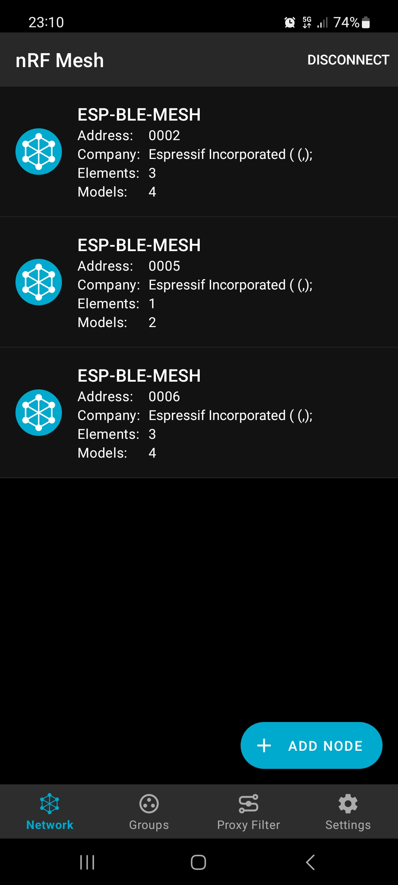

- Verificamos el funcionamiento tras conectar un led de prueba en el GPIO 25 pulsando en `ON` / `OFF` desde la aplicación.

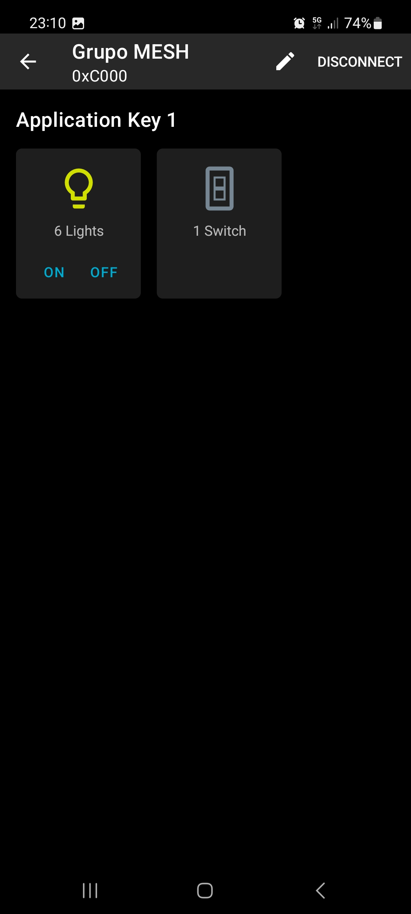

```BASH
I (484621) EXAMPLE: event 0x00, opcode 0x8203, src 0x0005, dst 0xffff
I (484621) EXAMPLE: ESP_BLE_MESH_GENERIC_SERVER_STATE_CHANGE_EVT
I (484621) EXAMPLE: onoff 0x00
I (486001) EXAMPLE: event 0x00, opcode 0x8203, src 0x0005, dst 0xffff
I (486001) EXAMPLE: ESP_BLE_MESH_GENERIC_SERVER_STATE_CHANGE_EVT
I (486011) EXAMPLE: onoff 0x01
I (486731) EXAMPLE: event 0x00, opcode 0x8203, src 0x0005, dst 0xffff
I (486731) EXAMPLE: ESP_BLE_MESH_GENERIC_SERVER_STATE_CHANGE_EVT
I (486731) EXAMPLE: onoff 0x00
I (487371) EXAMPLE: event 0x00, opcode 0x8203, src 0x0005, dst 0xffff
I (487371) EXAMPLE: ESP_BLE_MESH_GENERIC_SERVER_STATE_CHANGE_EVT
I (487371) EXAMPLE: onoff 0x01
I (488071) EXAMPLE: event 0x00, opcode 0x8203, src 0x0005, dst 0xffff
I (488071) EXAMPLE: ESP_BLE_MESH_GENERIC_SERVER_STATE_CHANGE_EVT
I (488071) EXAMPLE: onoff 0x00
```

- Verificamos también el funcionamiento pulsando el boton en el cliente:
```BASH
I (3258414) EXAMPLE_NVS: Store, key "onoff_client", length 6
I (3258414) EXAMPLE_NVS: Store, data: 00 00 00 00 00 4f
I (3259394) BOARD: tap cb (RELEASE)
I (3259404) EXAMPLE_NVS: Store, key "onoff_client", length 6
I (3259404) EXAMPLE_NVS: Store, data: 00 00 00 00 01 50
I (3260774) BOARD: tap cb (RELEASE)
I (3260784) EXAMPLE_NVS: Store, key "onoff_client", length 6
I (3260784) EXAMPLE_NVS: Store, data: 00 00 00 00 00 51
I (3261494) BOARD: tap cb (RELEASE)
I (3261504) EXAMPLE_NVS: Store, key "onoff_client", length 6
I (3261504) EXAMPLE_NVS: Store, data: 00 00 00 00 01 52
I (3262154) BOARD: tap cb (RELEASE)
I (3262164) EXAMPLE_NVS: Store, key "onoff_client", length 6
I (3262164) EXAMPLE_NVS: Store, data: 00 00 00 00 00 53
I (3262804) BOARD: tap cb (RELEASE)
I (3262824) EXAMPLE_NVS: Store, key "onoff_client", length 6
I (3262824) EXAMPLE_NVS: Store, data: 00 00 00 00 01 54
```

Para que el cliente solo envíe el mensaje de tipo `SET` modificamos el código incluyendo el identificador del groupo:

```c
    common.ctx.app_idx = store.app_idx;
    common.ctx.addr = 0xC000; /* ONLY TO MY GROUP 'GRUPO MESH' */
    common.ctx.send_ttl = 3;
```

A posteriori verificamos que solo el servidor con MAC `24:0a:c4:ea:28:c2` recibe el mensaje de tipo `SET` ya que `94:3c:c6:cd:bb:4e` no está suscrito y el cliente solo envía al grupo con id 0xC000.


## Modelo sensor

### Servidor

```BASH
I (641) main_task: Calling app_main()
I (641) EXAMPLE: Initializing...
I (691) gpio: GPIO[25]| InputEn: 0| OutputEn: 0| OpenDrain: 0| Pullup: 1| Pulldown: 0| Intr:0 
I (691) gpio: GPIO[26]| InputEn: 0| OutputEn: 0| OpenDrain: 0| Pullup: 1| Pulldown: 0| Intr:0 
I (701) gpio: GPIO[27]| InputEn: 0| OutputEn: 0| OpenDrain: 0| Pullup: 1| Pulldown: 0| Intr:0 
I (711) BTDM_INIT: BT controller compile version [946b762]
I (721) BTDM_INIT: Bluetooth MAC: 24:0a:c4:ea:28:c2
I (731) phy_init: phy_version 4670,719f9f6,Feb 18 2021,17:07:07
I (1221) EXAMPLE: ESP_BLE_MESH_PROV_REGISTER_COMP_EVT, err_code 0
I (1231) EXAMPLE: BLE Mesh sensor server initialized
I (1231) main_task: Returned from app_main()
I (1241) EXAMPLE: ESP_BLE_MESH_NODE_PROV_ENABLE_COMP_EVT, err_code 0
```

### Cliente

```BASH
I (657) main_task: Calling app_main()
I (657) EXAMPLE: Initializing...
use esp timer !!!
E (697) esp_timer: Task is already initialized
I (697) gpio: GPIO[0]| InputEn: 1| OutputEn: 0| OpenDrain: 0| Pullup: 1| Pulldown: 0| Intr:3
I (707) BTDM_INIT: BT controller compile version [946b762]
I (717) BTDM_INIT: Bluetooth MAC: 8c:aa:b5:b8:bf:f6
I (717) phy_init: phy_version 4670,719f9f6,Feb 18 2021,17:07:07
I (1217) EXAMPLE: ESP_BLE_MESH_PROV_REGISTER_COMP_EVT, err_code 0
I (1217) EXAMPLE: ESP_BLE_MESH_PROVISIONER_SET_DEV_UUID_MATCH_COMP_EVT, err_code 0
I (1227) EXAMPLE: BLE Mesh sensor client initialized
I (1227) main_task: Returned from app_main()
I (1237) EXAMPLE: ESP_BLE_MESH_PROVISIONER_PROV_ENABLE_COMP_EVT, err_code 0
I (1237) EXAMPLE: ESP_BLE_MESH_PROVISIONER_ADD_LOCAL_APP_KEY_COMP_EVT, err_code 0
I (1247) EXAMPLE: ESP_BLE_MESH_PROVISIONER_BIND_APP_KEY_TO_MODEL_COMP_EVT, err_code 0
I (1297) EXAMPLE: ESP_BLE_MESH_PROVISIONER_RECV_UNPROV_ADV_PKT_EVT
I (1297) Device address: 24 0a c4 ea 28 c2
I (1297) EXAMPLE: Address type 0x00, adv type 0x00
I (1307) Device UUID: 32 10 24 0a c4 ea 28 c2 00 00 00 00 00 00 00 00
I (1307) EXAMPLE: oob info 0x0000, bearer PB-GATT
I (1327) EXAMPLE: ESP_BLE_MESH_PROVISIONER_RECV_UNPROV_ADV_PKT_EVT
I (1327) Device address: 24 0a c4 ea 28 c2
I (1327) EXAMPLE: Address type 0x00, adv type 0x00
I (1337) Device UUID: 32 10 24 0a c4 ea 28 c2 00 00 00 00 00 00 00 00 
I (1337) EXAMPLE: oob info 0x0000, bearer PB-GATT
I (1347) EXAMPLE: ESP_BLE_MESH_PROVISIONER_ADD_UNPROV_DEV_COMP_EVT, err_code 0
W (1357) BLE_MESH: Device already exists in queue
I (1357) EXAMPLE: ESP_BLE_MESH_PROVISIONER_ADD_UNPROV_DEV_COMP_EVT, err_code -120
I (2527) EXAMPLE: ESP_BLE_MESH_PROVISIONER_PROV_LINK_OPEN_EVT, bearer PB-GATT
W (3007) BT_HCI: hci cmd send: disconnect: hdl 0x0, rsn:0x13
W (3007) BT_APPL: gattc_conn_cb: if=3 st=0 id=3 rsn=0x16
I (3017) EXAMPLE: node_index 0, primary_addr 0x0005, element_num 1, net_idx 0x000
I (3017) uuid: 32 10 24 0a c4 ea 28 c2 00 00 00 00 00 00 00 00 
I (3027) EXAMPLE: ESP_BLE_MESH_PROVISIONER_PROV_LINK_CLOSE_EVT, bearer PB-GATT, reason 0x16
W (3027) BT_HCI: hcif disc complete: hdl 0x0, rsn 0x16
I (3047) EXAMPLE: ESP_BLE_MESH_PROVISIONER_SET_NODE_NAME_COMP_EVT, err_code 0
I (3047) EXAMPLE: Node 0 name NODE-00
I (3267) EXAMPLE: Config client, event 0, addr 0x0005, opcode 0x8008
I (3267) Composition data: e5 02 00 00 00 00 0a 00 03 00 00 00 03 00 00 00
I (3267) Composition data: 00 11 01 11
I (3277) EXAMPLE: ********************** Composition Data Start **********************
I (3277) EXAMPLE: * CID 0x02e5, PID 0x0000, VID 0x0000, CRPL 0x000a, Features 0x0003 *
I (3287) EXAMPLE: * Loc 0x0000, NumS 0x03, NumV 0x00 *
I (3297) EXAMPLE: * SIG Model ID 0x0000 *
I (3297) EXAMPLE: * SIG Model ID 0x1100 *
I (3307) EXAMPLE: * SIG Model ID 0x1101 *
I (3307) EXAMPLE: *********************** Composition Data End ***********************
I (3317) EXAMPLE: ESP_BLE_MESH_PROVISIONER_STORE_NODE_COMP_DATA_COMP_EVT, err_code 0
I (3607) EXAMPLE: Config client, event 1, addr 0x0005, opcode 0x0000
I (3667) EXAMPLE: Config client, event 1, addr 0x0005, opcode 0x803d
I (3787) EXAMPLE: Config client, event 1, addr 0x0005, opcode 0x803d
W (3787) EXAMPLE: Provision and config successfully
I (5637) EXAMPLE: ESP_BLE_MESH_PROVISIONER_RECV_UNPROV_ADV_PKT_EVT
I (5637) Device address: 24 0a c4 ea 28 c2
I (5637) EXAMPLE: Address type 0x00, adv type 0x03
I (5647) Device UUID: 32 10 24 0a c4 ea 28 c2 00 00 00 00 00 00 00 00 
I (5647) EXAMPLE: oob info 0x0000, bearer PB-ADV
I (5667) EXAMPLE: ESP_BLE_MESH_PROVISIONER_PROV_LINK_OPEN_EVT, bearer PB-ADV
I (5667) EXAMPLE: ESP_BLE_MESH_PROVISIONER_ADD_UNPROV_DEV_COMP_EVT, err_code 0
I (7667) EXAMPLE: node_index 0, primary_addr 0x0005, element_num 1, net_idx 0x000
I (7667) uuid: 32 10 24 0a c4 ea 28 c2 00 00 00 00 00 00 00 00
I (7667) EXAMPLE: ESP_BLE_MESH_PROVISIONER_SET_NODE_NAME_COMP_EVT, err_code 0
I (7677) EXAMPLE: Node 0 name NODE-00
I (8067) EXAMPLE: Config client, event 0, addr 0x0005, opcode 0x8008
I (8067) Composition data: e5 02 00 00 00 00 0a 00 03 00 00 00 03 00 00 00
I (8067) Composition data: 00 11 01 11
I (8077) EXAMPLE: ********************** Composition Data Start **********************
I (8077) EXAMPLE: * CID 0x02e5, PID 0x0000, VID 0x0000, CRPL 0x000a, Features 0x0003 *
I (8087) EXAMPLE: * Loc 0x0000, NumS 0x03, NumV 0x00 *
I (8097) EXAMPLE: * SIG Model ID 0x0000 *
I (8097) EXAMPLE: * SIG Model ID 0x1100 *
I (8107) EXAMPLE: * SIG Model ID 0x1101 *
I (8107) EXAMPLE: *********************** Composition Data End ***********************
I (8117) EXAMPLE: ESP_BLE_MESH_PROVISIONER_STORE_NODE_COMP_DATA_COMP_EVT, err_code 0
I (8367) EXAMPLE: Config client, event 1, addr 0x0005, opcode 0x0000
I (8467) EXAMPLE: Config client, event 1, addr 0x0005, opcode 0x803d
I (8577) EXAMPLE: Config client, event 1, addr 0x0005, opcode 0x803d
W (8577) EXAMPLE: Provision and config successfully
I (9527) EXAMPLE: ESP_BLE_MESH_PROVISIONER_PROV_LINK_CLOSE_EVT, bearer PB-ADV, reason 0x00
```

### Tarea
> Estudia el código del cliente y del servidor, y observa a qué nodo se envían las peticionesdesde el cliente, qué operaciones se solicitan en cada pulsación de botón, y qué datosdevuelve el servidor en cada caso.

Mensajes al pulsar el boton del cliente mostrados en la salida del servidor:

```BASH
I (102631) EXAMPLE: ESP_BLE_MESH_MODEL_OP_SENSOR_GET
I (102641) Sensor Data: c0 0a 28 60 0b 3c
I (109811) EXAMPLE: Sensor server, event 1, src 0x0001, dst 0x0005, model_id 0x1100
I (109811) EXAMPLE: ESP_BLE_MESH_MODEL_OP_SENSOR_SERIES_GET
I (112611) EXAMPLE: Sensor server, event 1, src 0x0001, dst 0x0005, model_id 0x1100
I (112611) EXAMPLE: ESP_BLE_MESH_MODEL_OP_SENSOR_DESCRIPTOR_GET
I (112621) Sensor Descriptor: 56 00 00 00 00 00 00 00 5b 00 00 00 00 00 00 00
I (123391) EXAMPLE: Sensor server, event 1, src 0x0001, dst 0x0005, model_id 0x1101
I (123391) EXAMPLE: ESP_BLE_MESH_MODEL_OP_SENSOR_CADENCE_GET
I (193911) EXAMPLE: Sensor server, event 1, src 0x0001, dst 0x0005, model_id 0x1101
I (193911) EXAMPLE: ESP_BLE_MESH_MODEL_OP_SENSOR_SETTINGS_GET
I (198911) EXAMPLE: Sensor server, event 1, src 0x0001, dst 0x0005, model_id 0x1100
```

El cliente recibe la información correctamente:

```BASH
I (331817) EXAMPLE: Sensor client, event 0, addr 0x0005
I (331817) EXAMPLE: Sensor Series Status, opcode 0x0054, Sensor Property ID 0x0056
I (335387) EXAMPLE: Sensor client, event 0, addr 0x0005
I (335397) EXAMPLE: Sensor Descriptor Status, opcode 0x0051
I (335397) Sensor Descriptor: 56 00 00 00 00 00 00 00 5b 00 00 00 00 00 00 00
I (337127) EXAMPLE: Sensor client, event 0, addr 0x0005
I (337137) EXAMPLE: Sensor Cadence Status, opcode 0x0057, Sensor Property ID 0x0056
I (339117) EXAMPLE: Sensor client, event 0, addr 0x0005
I (339117) EXAMPLE: Sensor Settings Status, opcode 0x0058, Sensor Property ID 0x0056
I (343587) EXAMPLE: Sensor client, event 0, addr 0x0005
I (343597) EXAMPLE: Sensor Status, opcode 0x0052
I (343597) Sensor Data: c0 0a 28 60 0b 3c
I (343597) EXAMPLE: Format A, length 0x00, Sensor Property ID 0x0056
I (343607) Sensor Data: 28
I (343607) EXAMPLE: Format A, length 0x00, Sensor Property ID 0x005b
I (343617) Sensor Data: 3c
```